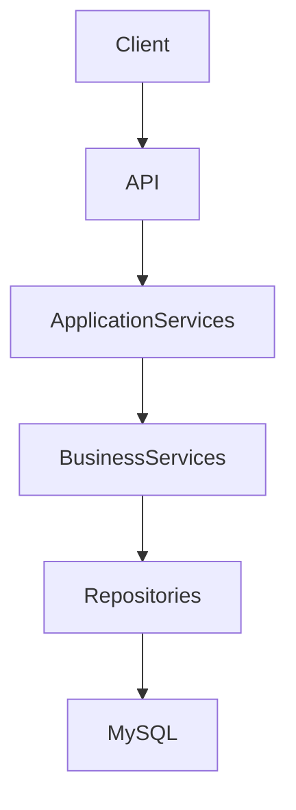

# GameTopUp Backend


---

## 🚀 Project Overview

GameTopUp is a backend system that centralises manual game top-up workflows into a structured order and payment platform.

The project focuses on transactional order processing, wallet balance management, inventory reservation, and explicit order state transitions. It explores practical backend engineering concerns such as transaction consistency, concurrency control, and layered architecture.

The project focuses mainly on backend workflow orchestration, transaction consistency, and concurrency handling rather than frontend or deployment infrastructure.

---

## 🛠️ Tech Stack

- **Framework**: ASP.NET Core 8 (C#)
- **Database**: MySQL 8.0 / MariaDB
- **Data Access**: Dapper + Dommel
- **Object Mapping**: Mapster
- **Containerisation**: Docker & Docker‑Compose
- **Testing**: xUnit, Moq, FluentAssertions, Microsoft.AspNetCore.Mvc.Testing, TestContainers

---

## 📦 Architecture

- **Presentation** (`GameTopUp.API`) – Controllers, global middleware, JWT authentication.
- **Application Services** – Orchestrates cross‑service use‑cases (`PlaceOrder`, `PayOrder`, `CancelOrder`). Defines transaction boundaries and may call multiple Business Services.
- **Business Services** – Encapsulates business rules for a single capability (wallet, order, inventory, commission). Each service mainly talks to its own repository.
- **Data Access** (`GameTopUp.DAL`) – Dapper repositories behind interfaces, sharing `DatabaseContext` for database access and transaction management.



---

## ⚙️ Core Engineering Decisions / Patterns

- **Unit of Work (`DatabaseContext`)** – Single DB connection & transaction shared across repositories, guaranteeing atomic multi‑step operations (wallet & order services).
- **Pessimistic Locking (`SELECT … FOR UPDATE`)** – Locks wallet & order rows during critical updates (`WalletRepository.GetWithLockByUserIdAsync`, `OrderRepository.GetWithLockByIdAsync`) to prevent race‑condition balance errors.
- **Conditional Stock Updates** – Uses atomic `UPDATE ... WHERE stock_quantity >= @Quantity` statements to prevent read-modify-write race conditions during stock reservation.
- **State‑Based Order Processing** – Explicit state machine (`Pending → Paid → Processing → Completed / Cancelled`) provides idempotent transitions and clear audit trails.
- **Standardised API Responses** – Uniform `ApiResponse<T>` wrapper simplifies client error handling and documentation.
- **Global Exception Handling** – Uses centralized middleware to map domain/business exceptions to proper HTTP responses, avoiding repeated `try-catch` logic in controllers.
- **Integration Tests with TestContainers** – Uses temporary MySQL containers to provide isolated, production-like integration testing.

---

## ✨ Features

- Wallet management with balance snapshots.
- Order placement with stock reservation.
- Separate payment step updating wallet and order state.
- Automatic inventory restoration on cancellation.
- Commission and discount tracking.
- Admin-managed deposit approval and order processing workflows.
- Consistent JSON response format.
- JWT‑based authentication and role‑based authorization.

---

## 🧪 Testing

- **Unit Tests** – BLL services mocked with Moq.
- **Integration Tests** – Uses TestContainers with temporary MySQL/MariaDB instances for isolated end‑to‑end testing.
- **Assertions** – FluentAssertions for clear expectations.

### Run Tests

> Docker Desktop must be running before executing integration tests.

```bash
dotnet test
```

---

## ▶️ Running the Project

### Prerequisites

- Docker Desktop
- .NET 8 SDK (for local development)

### 1. Setup Environment

```bash
cp .env.example .env
```
Update database credentials and JWT settings in `.env`.

---

### 2. Start Database

```bash
docker compose up -d db
```

---

### 3. Run the API

```bash
dotnet run --project GameTopUp.API
```
Swagger:
```
http://localhost:5000/swagger
```

---

### Optional: Run Full Docker Stack

```bash
docker compose up -d
```

---

## 📚 Learning Outcomes

- Managing transactional workflows across multiple services.
- Applying pessimistic locking for concurrency control.
- Designing layered backend architectures in ASP.NET Core.
- Writing isolated integration tests using TestContainers.

---

## 📖 Additional Documentation

- [`PROJECT_BACKGROUND.md`](./PROJECT_BACKGROUND.md) — Operational problems, project goals, and engineering motivation.
- [`API_GUIDE.md`](./API_GUIDE.md) — API endpoints, authentication, and response formats.
