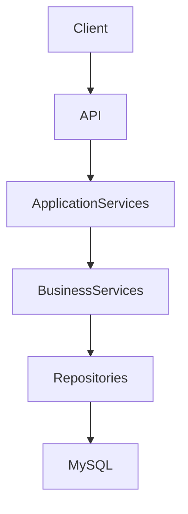

# GameTopUp Backend


---

## 🚀 Project Overview

GameTopUp is a backend system built to replace the manual chat-based workflows commonly used by small intermediary game top-up services offering discount-based transactions.

The project handles order processing, wallet balance management, inventory reservation, and order state transitions with a stronger focus on reliability and transactional consistency.

It was mainly developed to solve critical backend challenges such as transaction consistency, concurrency handling, and layered application design. The focus is on backend workflow orchestration and reliability rather than frontend development or deployment infrastructure.

---

## 🛠️ Tech Stack

- **Framework**: ASP.NET Core 8 (C#)
- **Database**: MySQL 8.0 / MariaDB
- **Data Access**: Dapper + Dommel
- **Object Mapping**: Mapster
- **Containerisation**: Docker & Docker‑Compose
- **Testing**: xUnit, Moq, FluentAssertions, Microsoft.AspNetCore.Mvc.Testing, TestContainers

---

## 📦 Architecture

- **Presentation** (`GameTopUp.API`) – Controllers, global middleware, JWT authentication.
- **Application Services** – Orchestrates cross‑service use‑cases (`PlaceOrder`, `PayOrder`, `CancelOrder`). Defines transaction boundaries and may call multiple Business Services.
- **Business Services** – Encapsulates business rules for a single capability (wallet, order, inventory, commission). Each service mainly talks to its own repository.
- **Data Access** (`GameTopUp.DAL`) – Dapper repositories behind interfaces, sharing `DatabaseContext` for database access and transaction management.



---

## ⚙️ Core Engineering Decisions / Patterns

- **Unit of Work (`DatabaseContext`)**: Shares a single DB connection and transaction across repositories through a scoped context instead of manually passing `IDbTransaction` through multiple layers. This keeps multi-step operations atomic while reducing transaction-handling boilerplate.

- **Pessimistic Locking (`SELECT ... FOR UPDATE`)**: Locks wallet and order rows during critical balance updates. This prevents race conditions (e.g., multiple payment requests on the same order) by forcing concurrent operations to execute sequentially.

- **Conditional Stock Updates**: Uses atomic `UPDATE ... WHERE stock_quantity >= @Quantity` queries for stock reservation. This eliminates the read-modify-write trap, allowing concurrent inventory updates without requiring a heavy `SERIALIZABLE` isolation level.

- **State-Based Order Processing**: Orders follow explicit transitions (`Pending → Paid → Processing → Completed / Cancelled`). This prevents invalid state changes and improves retry safety during payment processing.

- **Standardised API Responses**: All endpoints return a shared `ApiResponse<T>` structure. This keeps response handling predictable for frontend and API consumers.

- **Global Exception Handling**: Uses centralized middleware to map business exceptions into proper HTTP responses. This reduces duplicated `try-catch` logic inside controllers.

- **Integration Tests with TestContainers**: Runs integration tests against temporary MySQL Docker containers instead of in-memory databases. This ensures tests capture real database-specific behaviors such as locking and constraints in an isolated environment.

---

## ✨ Features

- Wallet management with balance snapshots.
- Order placement with stock reservation.
- Separate payment step updating wallet and order state.
- Automatic inventory restoration on cancellation.
- Commission and discount tracking.
- Admin-managed deposit approval and order processing workflows.
- Consistent JSON response format.
- JWT‑based authentication and role‑based authorization.

---

## 🧪 Testing

- **Unit Tests** – BLL services mocked with Moq.
- **Integration Tests** – Uses TestContainers with temporary MySQL/MariaDB instances for isolated end‑to‑end testing.
- **Assertions** – FluentAssertions for clear expectations.

### Run Tests

> Docker Desktop must be running before executing integration tests.

```bash
dotnet test
```

---

## ▶️ Running the Project

### Prerequisites

- Docker Desktop
- .NET 8 SDK (for local development)

### 1. Setup Environment

```bash
cp .env.example .env
```
Update database credentials and JWT settings in `.env`.

---

### 2. Start Database

```bash
docker compose up -d db
```

---

### 3. Run the API

```bash
dotnet run --project GameTopUp.API
```
Swagger:
```
http://localhost:5000/swagger
```

---

### Optional: Run Full Docker Stack

```bash
docker compose up -d
```

---

## 📚 Learning Outcomes

- Managing transactional workflows across multiple services.
- Applying pessimistic locking for concurrency control.
- Designing layered backend architectures in ASP.NET Core.
- Writing isolated integration tests using TestContainers.

---

## 📖 Additional Documentation

- [`PROJECT_BACKGROUND.md`](./PROJECT_BACKGROUND.md) — Operational problems, project goals, and engineering motivation.
- [`API_GUIDE.md`](./API_GUIDE.md) — API endpoints, authentication, and response formats.