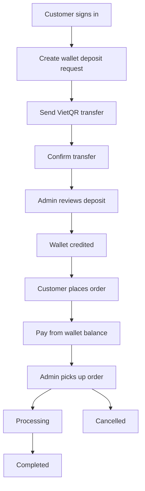

# GameTopUp


GameTopUp is a full-stack web application inspired by small intermediary game top-up services.

In this business model, a service owner obtains game packages or credits at discounted rates and resells them to players at a lower price than the official store while keeping a margin.

For example:

* Official store price: 100,000 VND
* Discounted purchase price: 80,000 VND
* Selling price: 90,000 VND

Players receive a better deal, while the service earns from the price difference.

Many of these services are managed through Facebook, Zalo, Discord, or direct messages. Customers send account information, transfer money manually, and wait for an operator to process each order. As the number of customers grows, keeping track of deposits, payments, package limits, and order progress becomes increasingly difficult.

The project was built to explore how that workflow could be organized into a single system instead of being managed through conversations and spreadsheets.

---

## Tech Stack

* **Backend:** ASP.NET Core Web API, Dapper, Dommel, MariaDB / MySQL, JWT Authentication, BCrypt Password Hashing, Swagger / OpenAPI
* **Frontend:** React, TypeScript, Vite, Zustand, TanStack Query, Tailwind CSS
* **Testing:** xUnit, Integration Tests, Testcontainers, Respawn
* **Development:** Docker, Docker Compose

---

## Project Overview

GameTopUp is designed for a small game top-up service rather than a large enterprise platform.

The goal is to centralize the core workflow into a web application where both customers and administrators can clearly see what is happening at each stage of the process.

### Customers can

* Deposit money through VietQR
* Add funds to a wallet balance
* Browse available games and packages
* Place and pay for orders
* Track order status and wallet activity

### Administrators can

* Review and approve deposit requests
* Manage games and top-up packages
* Process paid orders
* Control package availability
* Maintain operational and financial records

Instead of relying on chat history to understand what happened, the system keeps deposits, payments, orders, and status changes in one place.

---

## Why This Project?

Many small game top-up services start with a simple workflow:

1. A customer sends a message.
2. The customer transfers money.
3. The operator verifies the payment.
4. The operator processes the order manually.
5. Updates are sent back through chat.

This approach works at a small scale, but becomes harder to manage as more customers place orders. Payments, wallet balances, package limits, and order progress all need to stay synchronized.

GameTopUp was built to turn that manual process into a structured workflow that is easier to manage, easier to review, and less dependent on manual coordination.

---

## Key Workflows

### Customer Workflow

* Create a deposit request through VietQR
* Transfer money and confirm the payment
* Wait for deposit approval
* Add funds to the wallet
* Choose a game and package
* Place a top-up order
* Pay using wallet balance
* Track order progress and wallet activity

### Admin Workflow

* Review deposit requests
* Approve or reject wallet top-ups
* Manage games and packages
* Process paid orders
* Monitor package availability
* Maintain operational records

---

## System Flow



---

## Key Features

* **Clear order lifecycle** – Orders move through defined states from placement to completion, making the workflow easier to follow and manage.
* **Wallet-based payments** – Customers deposit funds once and use their wallet balance to pay for orders.
* **Deposit approval workflow** – Wallet top-ups require review before funds are credited, matching how the service operates in practice.
* **Package availability controls** – Administrators can define how many times a package may be sold, helping manage promotions, supplier limits, or service capacity.
* **Transaction history** – Deposits, payments, refunds, and wallet balance changes remain traceable over time.
* **Responsive and resilient user experience** – The interface is designed to work comfortably on both desktop and mobile devices while preserving order progress, cached data, and local state where appropriate.

---

## Engineering Challenges

Most of the challenges came from keeping the workflow reliable rather than building individual screens.

* Keeping wallet balances consistent across deposits, payments, and refunds
* Ensuring package limits are respected when multiple customers place orders at the same time
* Making order status transitions predictable and traceable
* Handling cancellations without leaving wallet or order records inconsistent
* Preventing the same order from being processed multiple times
* Keeping enough history to understand what happened when an order, deposit, or wallet balance changed

These challenges pushed the project beyond simple CRUD operations and required more attention to workflow design, state transitions, and data consistency.

---

## Getting Started

### Prerequisites

* Docker Desktop

### Setup

Create an environment file from the example:

```bash
cp .env.example .env
```

The default configuration is suitable for local development. Update environment values only if customization is needed.

### Run the Application

Start all services:

```bash
docker compose up -d
```

Once the containers are ready:

* Frontend: http://localhost:5173
* Backend API: http://localhost:5000
* Swagger UI: http://localhost:5000/swagger

The project is fully containerized with Docker Compose, allowing the frontend, backend, and database to be started together with a single command.

### Running Tests

```bash
dotnet test
```

---

## Future Improvements

Possible next steps for the project include:

* Better payment matching to reduce manual deposit review
* Richer notifications for order and wallet updates
* Revenue and operational reporting
* More detailed refund and dispute handling
* A more comprehensive admin dashboard

The current version already covers the core workflow, but these additions would move it closer to a real production service.
