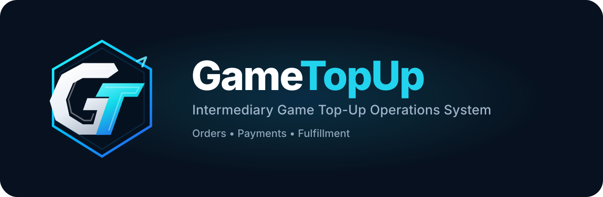

<p align="center">
  
</p>

# GameTopUp

GameTopUp is a web application that models the daily workflow of a small intermediary game top-up service.

This repository is maintained as a personal portfolio project, with a focus on backend workflows, testing and deployment.

The app focuses on the parts that are often handled manually: customer messages, bank transfers, package tracking and order processing.

[](https://github.com/MinhKhoa05/gametopup/actions/workflows/backend-ci.yml)
[](https://github.com/MinhKhoa05/gametopup/actions/workflows/frontend-ci.yml)
[](https://github.com/MinhKhoa05/gametopup/actions/workflows/deploy.yml)
[](https://github.com/MinhKhoa05/gametopup/actions/workflows/backend-ci.yml)


🇻🇳 Tiếng Việt: [README.vi.md](README.vi.md)

## Live Demo

**Website:** https://gametopup.minhkhoa.dev

The demo is seeded with accounts so you can try the main customer and admin flows without setting up the project locally.

| Role | Email | Password |
| ---- | ----- | -------- |
| Admin | `admin@gametopup.com` | `Admin123456@` |
| Customer | `customer01@gametopup.com` | `Admin123456@` |
| Customer | `customer02@gametopup.com` | `Admin123456@` |

> The demo database may be reset periodically.

## Overview

Small game top-up services often start with a very manual workflow.

Customers send messages. Staff check bank transfers. Orders are written down manually. Package availability is tracked by memory or spreadsheet. It works at the beginning, but it becomes fragile once deposits, orders and customers start moving at the same time.

GameTopUp turns that workflow into a web app.

Customers can browse games, choose packages, create wallet deposit requests, confirm transfers and place orders with wallet balance. Administrators can review deposits, manage games and packages, pick orders for processing and monitor the current state of the service from a dashboard.

The main flow ties together wallet balance changes, package slot reservation, order history and admin actions instead of treating them as isolated updates.

## Highlights

### Business Features

- Game and package browsing for customers.
- Wallet deposits with VietQR transfer information.
- Wallet transaction history for deposits, purchases and refunds.
- Order purchase flow with wallet balance validation and package slot reservation.
- Admin review flow for deposits.
- Admin order processing with pick, complete and cancel actions.
- Dashboard for pending orders, pending deposits and operational totals.

### Engineering

- Layered backend with controllers, use cases, services, repositories and read queries.
- Wallet, deposit and order workflows handled as coordinated operations.
- Transaction-aware workflows for balance updates, package slots and order state changes.
- Unit tests for service and use case behavior.
- Integration tests against MariaDB through Testcontainers.
- Concurrency tests for overselling, double approval, double refund and competing order transitions.

### Infrastructure

- Docker Compose setup for the app, API and database.
- Nginx configuration for frontend routing and production reverse proxy.
- GitHub Actions for backend/frontend checks and VPS deployment.

## Quick Start

The easiest way to get started is with Docker Compose.

### Prerequisites

The project requires Docker with Docker Compose support.
No local installation of .NET, Node.js or MariaDB is needed.

### Configure Environment

Copy the example environment file:

```bash
cp .env.example .env
```

Update the required values:

```env
DB_ROOT_PASSWORD=CHANGE_ME_ROOT_PASSWORD
DB_PASSWORD=YOUR_APP_PASSWORD
Jwt__Key=YOUR_SECURE_JWT_KEY_MIN_32_CHARS
App__BaseUrl=http://localhost:5000
Cors__AllowedOrigins__0=http://localhost:3000
VITE_API_BASE_URL=http://localhost:5000/api
VietQr__BankId=YOUR_BANK_ID
VietQr__AccountNo=YOUR_BANK_ACCOUNT_NO
VietQr__AccountName=YOUR_BANK_ACCOUNT_NAME
Email__FromEmail=noreply@gametopup.example
Email__Username=noreply@gametopup.example
Email__Password=YOUR_EMAIL_APP_PASSWORD
```

### Run

```bash
docker compose up -d
```

Services:

| Service | URL |
| ------- | --- |
| Frontend | http://localhost:3000 |
| Backend API | http://localhost:5000 |
| Swagger UI | Available in development environment |

The database is initialized from [database/schema.sql](database/schema.sql) and [database/seed.sql](database/seed.sql).

## Tech Stack

| Area | Stack |
| ---- | ----- |
| Backend | ASP.NET Core 8, C#, Dapper, Dommel |
| Frontend | React, TypeScript, Vite, TanStack Query, Tailwind CSS |
| Database | MariaDB / MySQL |
| Auth | JWT, HttpOnly cookies, BCrypt |
| Testing | xUnit, FluentAssertions, Moq, Testcontainers, Respawn, Coverlet |
| Delivery | Docker, Docker Compose, Nginx, GitHub Actions |

## Documentation

Want to learn more about the project?

| Document | Focus |
| -------- | ----- |
| [Overview](docs/overview.md) | Why the project exists and how it evolved |
| [Architecture](docs/architecture.md) | How the frontend, backend, database and deployment fit together |
| [Core Workflows](docs/core-workflows.md) | How deposits, wallet balance, purchases and admin processing work |
| [Frontend](docs/frontend.md) | Frontend organization, routing, state and user experience |
| [Testing](docs/testing.md) | Unit tests, integration tests, concurrency tests and coverage |
| [Deployment](docs/deployment.md) | Docker, Nginx, environment configuration and production deployment |
| [Engineering Decisions](docs/engineering-decisions.md) | The choices and trade-offs behind the implementation |

## Current Status

GameTopUp currently implements the complete workflow from wallet deposits to order processing and administration.

When a limitation or next step matters, it is mentioned in the document where that topic belongs.
