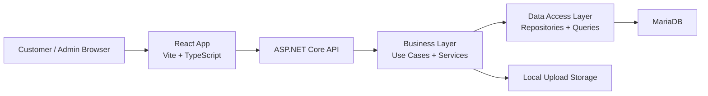
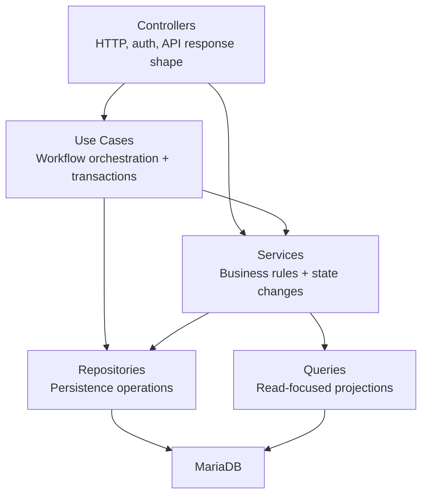
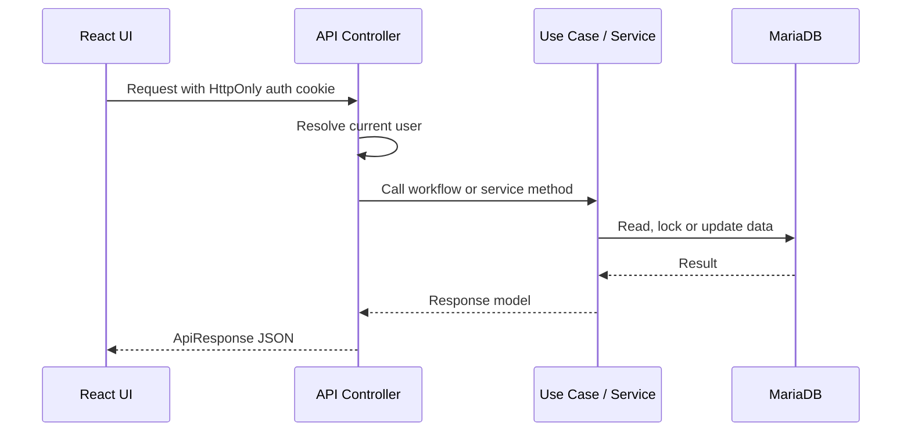
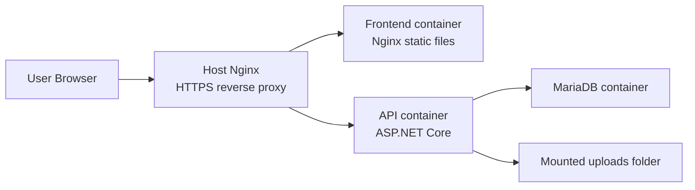

# Architecture

GameTopUp is split into a React frontend, an ASP.NET Core API and a MariaDB database.

This split keeps the UI, workflow logic and database code from blending into one large application. For a project with wallet balance, deposits, package capacity and order processing, that separation helps a lot.

The frontend handles the screens and server-state coordination. The backend owns business rules and transaction boundaries. The database stores the operational records: users, wallets, deposits, orders, package availability and history.

## High-Level Shape



The main repository folders mirror that shape:

```text
.
|-- frontend/       React application
|-- backend/
|   |-- GameTopUp.Api/
|   |-- GameTopUp.BLL/
|   |-- GameTopUp.DAL/
|   |-- GameTopUp.UnitTests/
|   `-- GameTopUp.IntegrationTests/
|-- database/       Schema and seed data
|-- deployments/    Production Nginx config
`-- docker-compose.yml
```

## Frontend

The frontend is organized around product areas rather than technical buckets.

Features such as `games`, `packages`, `wallet`, `deposits`, `orders`, `users` and `dashboard` live under `frontend/src/features`. Shared API helpers, formatting utilities and UI components live under `frontend/src/shared`.

That structure keeps the code close to how people use the app:

- Customers browse games and packages.
- Customers manage wallet deposits and orders.
- Admins review deposits, manage catalog data and process orders.

The frontend talks to the API through a shared Axios client. That client handles credentials, JSON/FormData behavior and session refresh when the API returns `401`.

TanStack Query handles server state. The project uses query persistence selectively, so cached data is not treated as a blanket default for every request.

More detail lives in [Frontend](frontend.md).

## Backend

The backend uses a practical layered structure.



The important decision is that controllers do not carry the main workflows.

For example, creating an order is not just an HTTP `POST`. It has to validate wallet balance, reserve package availability, create an order and record the wallet transaction. That sequence is visible in a use case.

The backend projects have distinct roles:

| Project | Role |
| ------- | ---- |
| `GameTopUp.Api` | Controllers, middleware, auth setup, configuration and HTTP response handling |
| `GameTopUp.BLL` | Use cases, services, contracts, mappings, options and business exceptions |
| `GameTopUp.DAL` | Entities, repositories, read queries and database context |
| `GameTopUp.UnitTests` | Service and use case tests |
| `GameTopUp.IntegrationTests` | API, workflow and concurrency tests against MariaDB |

This is not strict clean architecture. The structure is intentionally practical: enough to follow the flow, not so much that the project becomes harder to read.

## Request Flow

A typical authenticated request looks like this:



For simple reads, a controller may call a read service directly. For workflows with multiple state changes, the request goes through a use case.

That distinction keeps simple operations simple while still giving the important flows a clear place to live.

## Database

MariaDB stores the operational state of the app.

The central tables are:

| Table | Purpose |
| ----- | ------- |
| `users` | Customer and admin accounts |
| `wallets` | Current wallet balance per user |
| `wallet_transactions` | Balance movement history |
| `wallet_deposits` | Deposit requests and admin review state |
| `games` | Game catalog |
| `packages` | Purchasable top-up packages and available slots |
| `orders` | Customer orders and processing status |
| `order_history` | Status transitions and audit trail |
| `refresh_tokens` | Hashed refresh tokens for session renewal |

The schema is kept in [database/schema.sql](../database/schema.sql), with demo data in [database/seed.sql](../database/seed.sql).

One intentional choice is that package availability is modeled as available slots. This fits the domain better than warehouse-style inventory: the service needs to know how many more orders it can accept for a package, not where a physical item is stored.

## Authentication

Authentication uses JWTs stored in HttpOnly cookies.

The access token cookie is used by the API authentication middleware. The refresh token is also stored as a cookie, but the backend stores only a hash of the refresh token in the database.

When the frontend receives a `401`, it attempts a refresh request once and retries the original request. If refresh fails, the session-expired handler is triggered.

Token handling stays out of normal UI code, and session behavior stays consistent across pages.

## Deployment Shape

The deployed shape is small and direct:



Docker Compose runs the database, API and frontend containers. The host-level Nginx configuration routes `/api/` and `/uploads/` to the API and everything else to the frontend.

The deployment workflow is intentionally simple: CI validates the code, then the production workflow pulls the latest `main` branch on the VPS and rebuilds the containers.

More detail lives in [Deployment](deployment.md).

## Why This Shape Works For The Project

GameTopUp has enough workflow behavior to need structure, but not enough scope to justify heavy architecture.

This shape keeps the important parts visible:

- The frontend follows the product domain.
- The backend isolates workflow orchestration from HTTP details.
- Database operations that need locking or projection stay close to SQL.
- Tests can target business rules, API behavior and real database workflows separately.
- Docker keeps local and production runtime shape close enough to be useful.

That balance fits the goal of the repository: easy to browse from the outside, but still honest about the engineering decisions underneath.

## Next

The architecture shows where things live. The best next step is [Core Workflows](core-workflows.md), which explains how deposits, wallet balance, package slots and orders move through the app.
