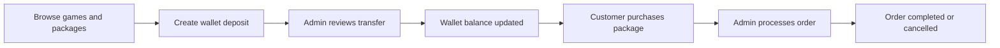
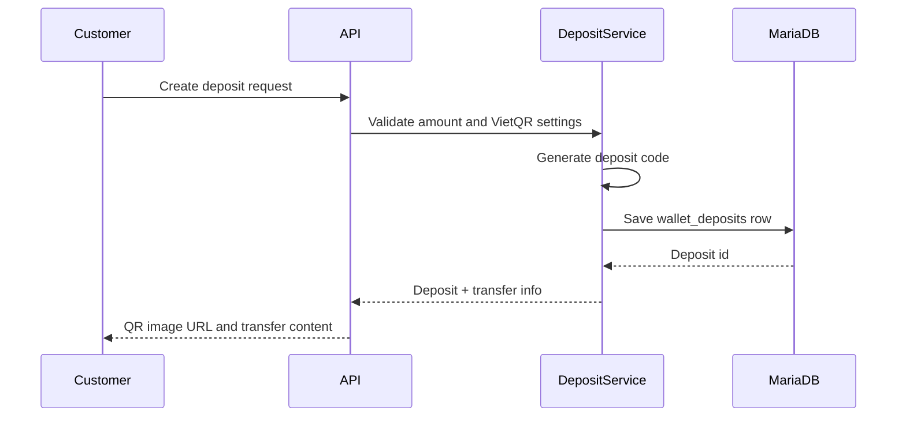
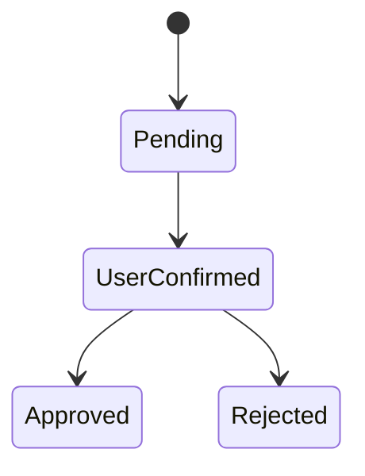
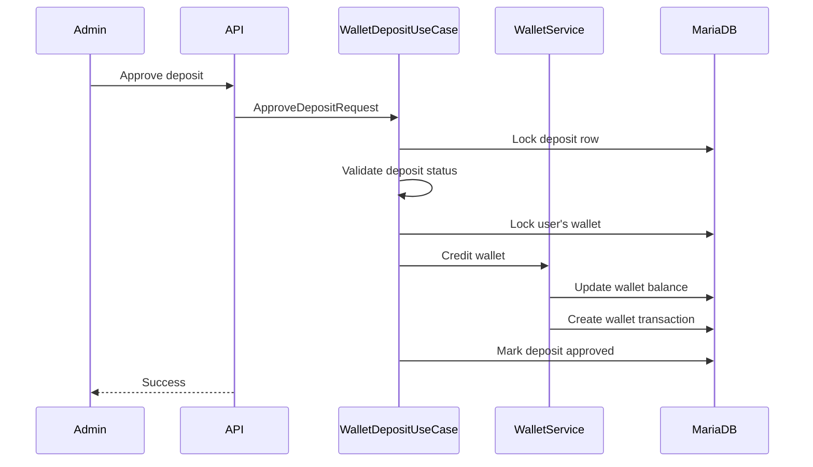
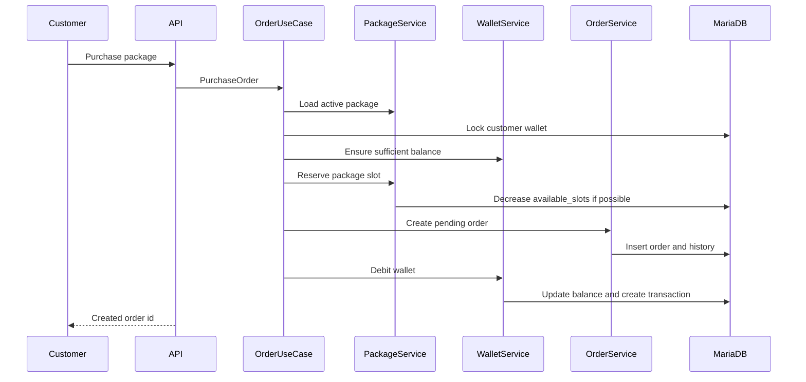
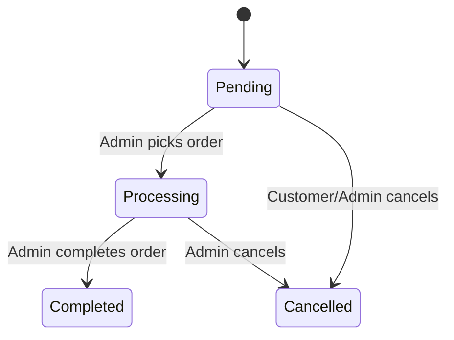
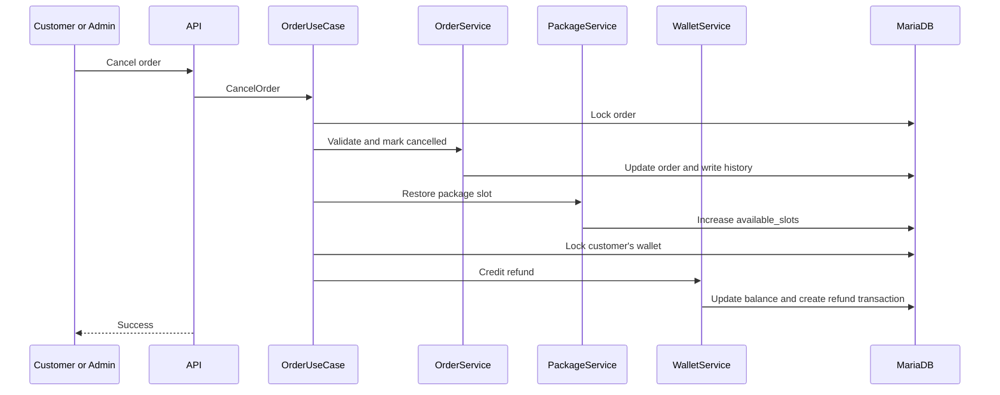

# Core Workflows

The core of GameTopUp is how wallet balance, package availability and order state move together.

This page explains the workflows that need the most care. It is less about endpoints and more about what needs to stay true while customers and admins are using the app.

For the broader system shape, see [Architecture](architecture.md). For why these workflows exist in the first place, start with [Overview](overview.md).

## The Operating Loop

At a high level, the app supports this loop:

Each step leaves a record behind. Deposit status, wallet transactions, order status and order history make the workflow easier to inspect later.

## Wallet Deposit

Customers do not pay an order directly. They first create a wallet deposit request.

That choice separates payment review from order purchasing. A customer can prepare funds once, then use wallet balance for orders later.

The deposit request stores:

- customer id
- amount
- unique deposit code
- transfer content
- current status
- review information once an admin handles it

The QR image URL is built from the configured VietQR bank information. The project does not automatically verify bank transfers. The user confirms that they transferred the money, and an admin reviews the request.

That is intentional for the current scope. The app models a small service where transfer verification is still a human admin task.

## Deposit Review

A deposit moves through a small state machine:

The customer can confirm only their own pending deposit. Admin approval is allowed only after the customer confirmation step.

When an admin approves the deposit, the workflow has to do more than change a status:

The wallet credit and deposit status update happen inside a transaction boundary. That matters because approval should not create a half-finished state where the deposit is approved but the wallet was not credited, or the wallet was credited without the deposit review being recorded.

The concurrency tests cover the risky version of this workflow: two admins approving the same deposit at nearly the same time. The expected result is one wallet credit, not two.

## Purchase Flow

The purchase flow is where wallet balance, package availability and order state meet.

From the customer's point of view, it is simple: choose a package, enter game account information and confirm the purchase.

From the backend's point of view, several things must line up:

- the package must exist and be active
- the customer must have enough wallet balance
- package availability must not go below zero
- the order must record the package price at purchase time
- the wallet deduction must be recorded as a transaction

Creating the order is not the first thing the backend does. The use case first validates the package and wallet, reserves capacity, creates the order, then records the wallet movement.

The package reservation uses an update that only succeeds when enough slots are still available. That prevents the app from accepting more orders than the package can handle.

GameTopUp tracks `available_slots` for packages.

That wording is deliberate. In this domain, a package is not necessarily a physical stock item. It represents how many more orders the service can accept for that package.

When a customer purchases a package, one slot is reserved. When an order is cancelled, one slot is restored.

This matches how a small top-up service operates, where capacity is limited by how many orders can still be accepted rather than by physical inventory.

## Admin Order Processing

After purchase, an order starts as `Pending`.

An admin can pick it for processing, complete it, or cancel it.

Picking an order assigns it to an admin and moves it into `Processing`. Completing it moves it to `Completed`.

Each meaningful transition writes order history. That makes the order easier to inspect later, especially when several people are involved in operating the service.

The project also protects the pick flow from races. If two admins try to pick the same pending order, only one should become the assigned admin.

## Cancellation And Refund

Cancellation was one of the easiest places to accidentally build a bug.

It cannot be treated as "set order status to cancelled" because a purchased order already affected wallet balance and package availability.

When an order is cancelled, the workflow has to:

- lock the order
- make sure the transition is allowed
- write order history
- restore one package slot
- lock the customer's wallet
- credit the wallet
- record a refund transaction

The implementation treats repeated cancellation carefully. If an order is already cancelled, the workflow returns without refunding again. That behavior is covered by concurrency tests because double refund is the kind of bug that can be missed when only the normal path is tested.

## Where Consistency Matters Most

The riskiest parts of GameTopUp are the places where two users or admins can act at the same time.

The most sensitive workflows are:

- two customers trying to buy the last available package slot
- two admins approving the same deposit
- two requests trying to cancel the same order
- an admin picking an order while the customer tries to cancel it

These are not abstract edge cases. They are the places where balance, availability and order state can drift if the workflow is not designed carefully.

The project uses explicit transaction boundaries, row locking where needed and integration tests against MariaDB instead of relying only on mocked unit tests.

## Continue Reading

The workflows described here are implemented through the layered architecture introduced earlier.

The next documents explain why these implementation choices were made and how the workflows are verified through automated tests.

- [Engineering Decisions](engineering-decisions.md) explains the trade-offs behind the structure.
- [Testing](testing.md) shows how these flows are protected.
