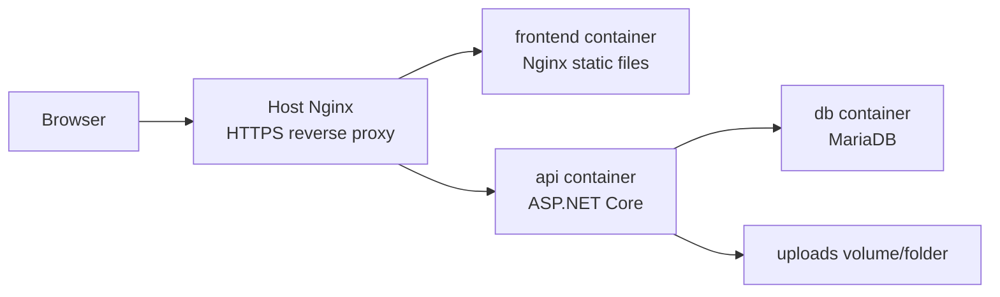
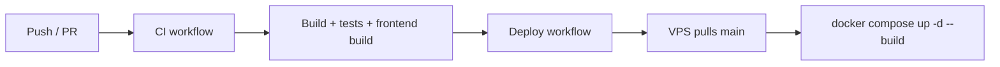

# Deployment

🇻🇳 Tiếng Việt: [docs/vi/deployment.md](vi/deployment.md)

The GameTopUp live demo runs as a small VPS-hosted app.

Docker Compose runs the containers, Nginx handles public HTTPS traffic, and GitHub Actions deploys the latest `main` branch to a VPS after CI passes.

The deployment path is direct: build the app, run the containers, route traffic through Nginx, and update the server from GitHub Actions.

## Runtime Shape

Docker Compose defines three services:

| Service | Role |
| ------- | ---- |
| `db` | MariaDB database with schema and seed initialization |
| `api` | ASP.NET Core backend |
| `frontend` | Built React app served by Nginx |

The API stores uploaded files under `wwwroot/uploads`, mounted from the repository `uploads` folder in the compose setup.

## Building The Application

The backend Dockerfile uses a multi-stage build.

The first stage restores and publishes the API with the .NET SDK image. The runtime stage uses the smaller ASP.NET Core Alpine image and runs `GameTopUp.Api.dll`.

That keeps build tooling out of the final runtime image.

The frontend Dockerfile also uses two stages.

The build stage installs dependencies and creates the Vite production build. The runtime stage uses Nginx to serve the compiled static files.

The frontend Nginx config sends unknown routes back to `index.html`, which is needed for client-side routing.

Static assets are cached with immutable cache headers.

Once both applications are built into containers, production does not need a local .NET SDK or Node.js install to run the app.

## Running The Containers

The root [docker-compose.yml](../docker-compose.yml) is the main entry point for running the containers.

Compose starts the database, waits for it to become healthy, then starts the API and frontend containers.

Each container has one responsibility.

The database initializes the schema and seed data with MariaDB 11. The API exposes the business logic on port `8080` inside the container. The frontend serves the compiled React application through Nginx.

Runtime settings such as database credentials, JWT, CORS, app URL and VietQR values are passed through environment variables.

## Serving Public Traffic

Public traffic is routed through the host Nginx config in [deployments/nginx/gametopup.conf](../deployments/nginx/gametopup.conf).

The config routes:

| Path | Target |
| ---- | ------ |
| `/` | frontend container |
| `/api/` | backend API |
| `/uploads/` | backend API static files |

It also configures HTTPS through Let's Encrypt certificate paths and redirects HTTP traffic to HTTPS for the configured domain.

## Configuration

Configuration comes from `.env` values in Compose and environment override logic in the API.

Important values include:

| Variable | Purpose |
| -------- | ------- |
| `DB_ROOT_PASSWORD` | MariaDB root password |
| `DB_PASSWORD` | Application database password |
| `JWT_KEY` | JWT signing key |
| `APP_BASE_URL` | Public base URL used by backend-generated links |
| `CORS_ALLOWED_ORIGINS` | Allowed frontend origins |
| `VITE_API_BASE_URL` | API base URL compiled into the frontend |
| `VIETQR_BANK_ID` | VietQR bank id |
| `VIETQR_ACCOUNT_NO` | VietQR account number |
| `VIETQR_ACCOUNT_NAME` | VietQR account name |

The API maps these environment variables into configuration at startup. That keeps local and production configuration explicit without hardcoding secrets, and lets the same application run in both environments without changing the code.

## Deployment Pipeline

Deployment is tied to GitHub Actions.

The deploy workflow runs after the CI workflow completes successfully on `main`.

It connects to the VPS through SSH, moves into `/opt/gametopup`, fetches the latest code, resets the working tree to `origin/main`, rebuilds containers with Docker Compose and prunes old images.

The workflow stays easy to trace from the repository to the running demo.

## Current Limitations

The current setup has a few clear limits:

- no blue-green deployment
- no automated database migration tool
- no container registry workflow
- no production monitoring stack in the repo
- uploaded files are stored locally on the server

Those trade-offs are acceptable at this stage. What matters for now is that the project has a repeatable path from repository to live demo.

## Continue Reading

For why these trade-offs were made, read [Engineering Decisions](engineering-decisions.md).

For the broader runtime shape, read [Architecture](architecture.md).
