# Testing

🇻🇳 Tiếng Việt: [docs/vi/testing.md](vi/testing.md)

GameTopUp's test suite focuses on workflows where operational state can drift.

Wallet balance, deposit review, package availability and order processing affect each other. A bug in those flows is not just a wrong response; it can mean a double wallet credit, an oversold package slot or an order ending in the wrong state.

The test suite is built around that risk. Coverage is collected, but the main targets are workflows where operational mistakes affect balances, package slots or order state.

## Testing Strategy

The backend relies on two kinds of tests:

| Project | Focus |
| ------- | ----- |
| `GameTopUp.UnitTests` | Business rules, services and use cases |
| `GameTopUp.IntegrationTests` | API behavior, database persistence, workflow consistency and concurrency |

Unit tests give fast feedback for rules that can be checked in isolation.

Integration tests cover the places where the API, database and workflow state need to be exercised together. Wallet locks, package slot updates, transaction boundaries and repeated admin actions all depend on the database behaving correctly, so those tests run against MariaDB instead of mocks.

The frontend does not have a dedicated test suite. Frontend checks in CI are type checking and production build.

## Unit Tests

Unit tests cover the smaller business rules where feedback should be quick and isolated.

They cover rules that can be tested without running the full API or database. That includes validation, token behavior, wallet balance rules, deposit state transitions, notification creation, package slot checks, order state transitions, image URL behavior and use case orchestration for auth, orders and deposits.

The service layer contains business rules rather than only forwarding calls to repositories. Service tests usually fail near the rule being changed.

Transaction orchestration lives in use cases. Services handle smaller business-rule responsibilities, so many rules can be tested without database infrastructure.

## Integration Tests

The integration tests run against MariaDB through Testcontainers.

Several workflows depend on SQL behavior such as row locking, transactions and conditional updates. Testing those parts against an in-memory substitute would miss the behavior the app actually relies on.

The integration setup runs the API with `WebApplicationFactory`, starts a disposable MariaDB container through Testcontainers, loads the real schema from `database/schema.sql`, resets state between tests with Respawn and uses a test auth handler so scenarios can focus on API behavior.

The setup exercises the API and database together without depending on a shared local database.

## API Scenario Tests

API scenario tests cover both customer and admin workflows.

On the customer side, they check flows such as authentication, public game and package browsing, wallet reads, deposit requests, notifications and orders. On the admin side, they cover dashboard data, game and package management, deposit review, order processing and user management.

They go past status-code checks. The tests seed data, call the API and verify the resulting database state.

## Full Purchase Journey

The integration tests include a purchase journey that follows the main business path.

```mermaid
flowchart LR
    Wallet["Seed wallet balance"]
    Package["Seed package"]
    Purchase["Create order"]
    VerifyDebit["Verify wallet debit"]
    VerifySlot["Verify slot reserved"]
    Pick["Admin picks order"]
    Complete["Admin completes order"]
    History["Verify history"]

    Wallet --> Package --> Purchase --> VerifyDebit --> VerifySlot --> Pick --> Complete --> History
```



The purchase journey crosses several parts of the app: wallet, package, order and history.

## Concurrency Tests

The concurrency tests cover request races in the workflow layer.

They cover the failures that usually only appear when multiple requests happen at nearly the same time:

- two customers trying to purchase the last package slot
- two admins trying to approve the same deposit
- one admin approving while another rejects the same deposit
- two requests cancelling the same order
- an admin picking an order while the customer cancels it
- two admins trying to pick the same order

The expected behavior is not always "one request succeeds and one fails." Some operations are idempotent. Repeated cancellation, for example, should not create a double refund.

Concurrency tests cover mistakes that a happy-path demo would probably hide.

## CI And Coverage

The CI pipeline follows the same separation as the repository itself.

Backend and frontend jobs are split based on changed paths.

The backend job restores and builds the .NET solution, runs unit and integration tests, then publishes test and coverage reports. The frontend job installs npm dependencies, runs TypeScript type checking and builds the frontend.

Path-based CI separates backend and frontend jobs. A frontend-only change does not need to run backend integration tests, and a backend-only change does not need to rebuild the frontend.

Coverage is collected with Coverlet and reported through ReportGenerator. CI publishes the reports automatically. The workflow tests cover wallet credits, refunds, package slots and order transitions.

## Local Commands

Useful backend commands:

```bash
dotnet test backend/GameTopUp.UnitTests/GameTopUp.UnitTests.csproj
dotnet test backend/GameTopUp.IntegrationTests/GameTopUp.IntegrationTests.csproj
dotnet test backend/GameTopUp.slnx
```

Useful frontend commands:

```bash
cd frontend
npm run typecheck
npm run build
```

Integration tests require Docker because each test run starts a disposable MariaDB container through Testcontainers.

## Workflow Coverage

The test suite is centered on backend workflows where several pieces of state change together.

Frontend coverage is basic: CI runs type checking and production builds.

The highest workflow coverage is around wallet, package and order logic.

The suite contains more than 200 automated tests.

## Related Topics

For how these workflows are shipped, read [Deployment](deployment.md).

For test boundaries and database-backed testing constraints, see [Engineering Decisions](engineering-decisions.md).
