# Testing

🇻🇳 Tiếng Việt: [docs/vi/testing.md](vi/testing.md)

Testing became more important as GameTopUp's workflows became more connected.

Once wallet balance, deposit review, package availability and order processing started affecting each other, a bug was no longer just a wrong response. It could mean a double wallet credit, an oversold package slot or an order ending in the wrong state.

The test suite is focused around that risk. Coverage is useful, but the main value is protecting the workflows where operational mistakes would hurt the most.

## Testing Strategy

The backend relies on two kinds of tests:

| Project | Focus |
| ------- | ----- |
| `GameTopUp.UnitTests` | Business rules, services and use cases |
| `GameTopUp.IntegrationTests` | API behavior, database persistence, workflow consistency and concurrency |

Unit tests give fast feedback for rules that can be checked in isolation.

Integration tests cover the places where the API, database and workflow state need to be exercised together. Wallet locks, package slot updates, transaction boundaries and repeated admin actions all depend on the database behaving correctly, so those tests run against MariaDB instead of mocks.

The frontend does not currently have a dedicated test suite. Frontend checks in CI are type checking and production build.

## Unit Tests

Unit tests cover the smaller business rules where feedback should be quick and isolated.

They are useful when the rule can be tested without running the full API or database. That includes validation, token behavior, wallet balance rules, deposit state transitions, package slot checks, order state transitions, image URL behavior and use case orchestration for auth, orders and deposits.

These tests stay valuable because the service layer contains real business rules rather than simply forwarding calls to repositories. When a rule changes, the test usually points close to the code that needs attention.

The backend structure also helps here. As transaction orchestration lives in use cases and services stay focused on smaller responsibilities, many rules can be tested without bringing database infrastructure into the unit test.

## Integration Tests

The integration tests run against MariaDB through Testcontainers.

That choice came from the shape of the project. Several important workflows depend on SQL behavior such as row locking, transactions and conditional updates. Testing those parts against an in-memory substitute would miss the behavior the app actually relies on.

The integration setup runs the API with `WebApplicationFactory`, starts a disposable MariaDB container through Testcontainers, loads the real schema from `database/schema.sql`, resets state between tests with Respawn and uses a test auth handler so scenarios can focus on API behavior.

This lets the tests exercise the API and database together without depending on a shared local database.

## API Scenario Tests

API scenario tests cover both customer and admin workflows.

On the customer side, they check flows such as authentication, public game and package browsing, wallet reads, deposit requests and orders. On the admin side, they cover dashboard data, game and package management, deposit review, order processing and user management.

They go past status-code checks. The tests seed data, call the API and verify the resulting database state.

## Full Purchase Journey

The integration tests include a purchase journey that follows the main business path.

```mermaid
flowchart LR
    Wallet["Seed wallet balance"]
    Package["Seed package"]
    Purchase["Create order"]
    VerifyDebit["Verify wallet debit"]
    VerifySlot["Verify slot reserved"]
    Pick["Admin picks order"]
    Complete["Admin completes order"]
    History["Verify history"]

    Wallet --> Package --> Purchase --> VerifyDebit --> VerifySlot --> Pick --> Complete --> History
```



This type of test is useful because the purchase flow crosses several parts of the app: wallet, package, order and history.

## Concurrency Tests

The concurrency tests are one of the most important parts of the suite.

They cover the failures that usually only appear when multiple requests happen at nearly the same time:

- two customers trying to purchase the last package slot
- two admins trying to approve the same deposit
- one admin approving while another rejects the same deposit
- two requests cancelling the same order
- an admin picking an order while the customer cancels it
- two admins trying to pick the same order

The expected behavior is not always "one request succeeds and one fails." Some operations are idempotent. Repeated cancellation, for example, should not create a double refund.

These tests keep the suite honest. They check the kinds of mistakes that a happy-path demo would probably hide.

## CI And Coverage

The CI pipeline follows the same separation as the repository itself.

Backend and frontend jobs are split based on changed paths.

The backend job restores and builds the .NET solution, runs unit and integration tests, then publishes test and coverage reports. The frontend job installs npm dependencies, runs TypeScript type checking and builds the frontend.

That split keeps the workflow practical. A frontend-only change does not need to run backend integration tests, and a backend-only change does not need to rebuild the frontend.

Coverage is collected with Coverlet and reported through ReportGenerator. CI publishes the reports automatically, but coverage is only useful when the right behavior is protected. A high coverage number would not mean much if wallet credits, refunds, package slots and order transitions were not tested.

## Local Commands

Useful backend commands:

```bash
dotnet test backend/GameTopUp.UnitTests/GameTopUp.UnitTests.csproj
dotnet test backend/GameTopUp.IntegrationTests/GameTopUp.IntegrationTests.csproj
dotnet test backend/GameTopUp.slnx
```

Useful frontend commands:

```bash
cd frontend
npm run typecheck
npm run build
```

Integration tests require Docker because each test run starts a disposable MariaDB container through Testcontainers.

## What The Tests Say About The Project

The tests show what GameTopUp protects first.

They focus less on every button click or possible UI path, and more on the places where a bug would hurt the most: wallet balance changes, deposit approval, refunds, package capacity and order state transitions.

That focus matches the project. GameTopUp is built around workflows where several pieces of state move together, so the tests spend most of their energy there.

There is still room to grow, especially on the frontend side. Interaction tests would be a natural next step. For the current version, the most important thing is that the business-critical workflows are covered by fast unit tests, API scenario tests and database-backed integration tests.

Looking back, the most useful tests were not the ones that increased coverage. They were the ones that made it easier to change the code with confidence.

Today, the suite has grown to more than 200 automated tests covering the project's core workflows.

The number itself matters less than what it represents: workflows with higher operational risk, such as wallet credits, package reservations, refunds and order state transitions, can now be changed with more confidence.

## Next

For how these workflows are shipped, read [Deployment](deployment.md).

For the trade-offs behind the test strategy, see [Engineering Decisions](engineering-decisions.md).
