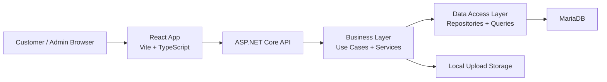
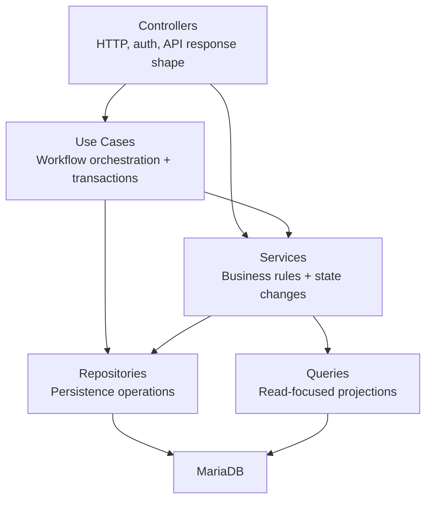
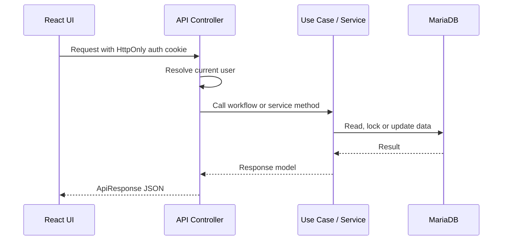
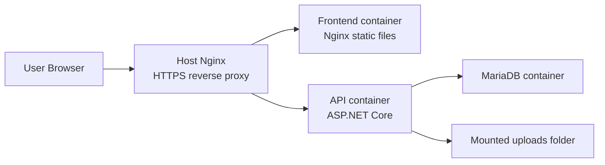

# Architecture

🇺🇸 English: [../architecture.md](../architecture.md)

GameTopUp được chia thành React frontend, ASP.NET Core API và MariaDB database.

Cách chia này giúp UI, workflow logic và database code không bị trộn vào một khối lớn. Với một project có wallet balance, deposits, package capacity và order processing, việc giữ những phần này tách nhau là cần thiết.

Frontend xử lý màn hình và server-state coordination. Backend giữ business rules và transaction boundaries. Database lưu operational records: users, wallets, deposits, orders, package availability và history.

## High-Level Shape



Các folder chính trong repository cũng đi theo cách chia đó:

```text
.
|-- frontend/       React application
|-- backend/
|   |-- GameTopUp.Api/
|   |-- GameTopUp.BLL/
|   |-- GameTopUp.DAL/
|   |-- GameTopUp.UnitTests/
|   `-- GameTopUp.IntegrationTests/
|-- database/       Schema and seed data
|-- deployments/    Production Nginx config
`-- docker-compose.yml
```

## Frontend

Frontend được tổ chức quanh product areas thay vì chỉ chia theo technical buckets.

Các feature như `games`, `packages`, `wallet`, `deposits`, `orders`, `users` và `dashboard` nằm trong `frontend/src/features`. API helpers dùng chung, formatting utilities và UI components nằm trong `frontend/src/shared`.

Cách tổ chức này giữ code gần với cách người dùng thật sự sử dụng app:

- Customer xem games và packages.
- Customer quản lý wallet deposits và orders.
- Admin duyệt deposits, quản lý catalog data và xử lý orders.

Frontend gọi API thông qua một shared Axios client. Client này xử lý credentials, JSON/FormData và session refresh khi API trả về `401`.

TanStack Query quản lý server state. Project dùng query persistence có chọn lọc, nên cached data không bị xem như mặc định cho mọi request.

Chi tiết hơn nằm trong [Frontend](frontend.md).

## Backend

Backend dùng một layered structure thực dụng.



Controllers khá mỏng.

Ví dụ, tạo order không chỉ là một HTTP `POST`. Nó phải kiểm tra wallet balance, giữ package availability, tạo order và ghi lại wallet transaction. Chuỗi đó được thể hiện rõ trong một use case.

Các backend projects có vai trò riêng:

| Project | Vai trò |
| ------- | ------- |
| `GameTopUp.Api` | Controllers, middleware, auth setup, configuration và HTTP response handling |
| `GameTopUp.BLL` | Use cases, services, contracts, mappings, options và business exceptions |
| `GameTopUp.DAL` | Entities, repositories, read queries và database context |
| `GameTopUp.UnitTests` | Tests cho services và use cases |
| `GameTopUp.IntegrationTests` | API, workflow và concurrency tests chạy với MariaDB |

Đây không phải strict clean architecture. Structure vẫn thực dụng: đủ để lần theo flow, nhưng không nhiều đến mức project khó đọc hơn.

## Request Flow

Một authenticated request thường đi như sau:



Với các read đơn giản, controller có thể gọi read service trực tiếp. Với những workflow có nhiều state changes, request đi qua use case.

Sự khác biệt này giữ những việc đơn giản vẫn đơn giản, đồng thời cho các flow quan trọng một nơi rõ ràng để nằm lại.

## Database

MariaDB lưu operational state của app.

Các bảng trung tâm là:

| Table | Mục đích |
| ----- | -------- |
| `users` | Customer và admin accounts |
| `wallets` | Số dư ví hiện tại của từng user |
| `wallet_transactions` | Lịch sử thay đổi số dư |
| `wallet_deposits` | Deposit requests và trạng thái admin review |
| `games` | Game catalog |
| `packages` | Top-up packages có thể mua và available slots |
| `orders` | Customer orders và trạng thái xử lý |
| `order_history` | Status transitions và audit trail |
| `refresh_tokens` | Hashed refresh tokens cho session renewal |

Schema nằm trong [database/schema.sql](../../database/schema.sql), cùng demo data trong [database/seed.sql](../../database/seed.sql).

Package availability được biểu diễn bằng available slots. Cách này hợp domain hơn kiểu warehouse inventory: dịch vụ cần biết package này còn nhận thêm được bao nhiêu order, chứ không phải một item vật lý đang nằm ở đâu.

## Authentication

Authentication dùng JWT lưu trong HttpOnly cookies.

Access token cookie được API authentication middleware sử dụng. Refresh token cũng được lưu bằng cookie, nhưng backend chỉ lưu hash của refresh token trong database.

Khi frontend nhận `401`, nó thử gọi refresh request một lần rồi retry request ban đầu. Nếu refresh thất bại, session-expired handler được kích hoạt.

Token handling không bị rải vào UI code, và session behavior nhất quán giữa các trang.

## Deployment Shape

Hình dạng khi deploy nhỏ và trực tiếp:



Docker Compose chạy database, API và frontend containers. Host-level Nginx configuration route `/api/` và `/uploads/` về API, còn phần còn lại về frontend.

Deployment workflow khá gọn: CI validate code, sau đó production workflow pull nhánh `main` mới nhất trên VPS và rebuild containers.

Chi tiết hơn nằm trong [Deployment](deployment.md).

## Why This Shape Works For The Project

GameTopUp có đủ workflow để cần structure, nhưng chưa lớn đến mức cần một architecture nặng.

Hình dạng này giữ các phần quan trọng dễ nhìn thấy:

- Frontend đi theo product domain.
- Backend tách workflow orchestration khỏi HTTP details.
- Database operations cần locking hoặc projection vẫn gần với SQL.
- Tests có thể nhắm riêng vào business rules, API behavior và workflows chạy với database thật.
- Docker giữ local và production runtime shape đủ gần nhau để hữu ích.

Sự cân bằng đó hợp với tinh thần của repository: dễ đọc từ bên ngoài, nhưng vẫn trung thực về các engineering decisions bên dưới.

## Next

Architecture cho thấy mọi thứ nằm ở đâu. Bước đọc tiếp hợp lý là [Core Workflows](core-workflows.md), nơi giải thích deposits, wallet balance, package slots và orders di chuyển qua app như thế nào.
