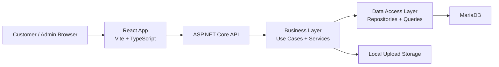
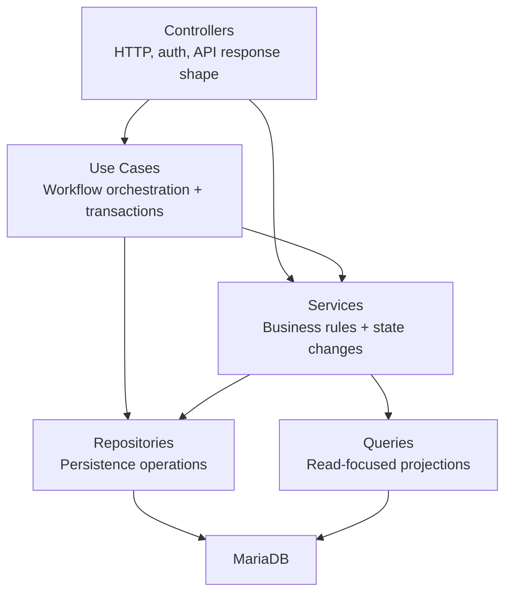
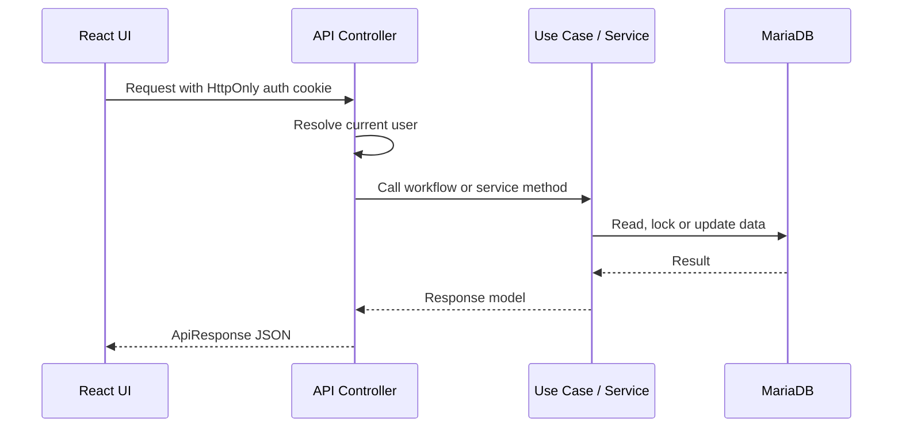
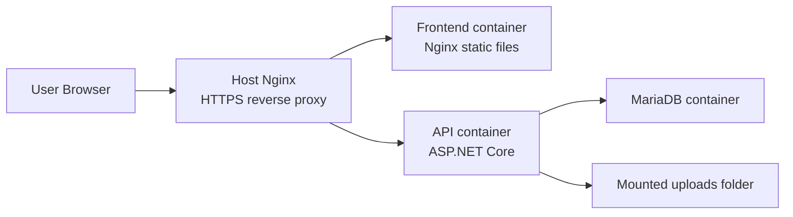

# Kiến trúc

🇺🇸 English: [../architecture.md](../architecture.md)

GameTopUp được chia thành React frontend, ASP.NET Core API và MariaDB database.

UI, workflow logic và database code nằm trong các layer riêng. Số dư ví, yêu cầu nạp tiền, package availability và xử lý đơn hàng đi qua các layer đó bằng API calls và backend workflows.

Frontend phụ trách màn hình và server state. Backend giữ business rules và transaction boundaries. Database lưu các bản ghi vận hành như users, wallets, deposits, orders, packages, notifications và history.

## Cấu trúc ứng dụng



Các folder chính trong repository cũng đi theo cách chia đó:

```text
.
|-- frontend/       React application
|-- backend/
|   |-- GameTopUp.Api/
|   |-- GameTopUp.BLL/
|   |-- GameTopUp.DAL/
|   |-- GameTopUp.UnitTests/
|   `-- GameTopUp.IntegrationTests/
|-- database/       Schema and seed data
|-- deployments/    Production Nginx config
`-- docker-compose.yml
```

## Frontend

Frontend được tổ chức theo feature/product area, thay vì chỉ chia theo technical buckets.

Các feature như `games`, `packages`, `wallet`, `deposits`, `orders`, `notifications`, `users` và `dashboard` nằm trong `frontend/src/features`. API helpers dùng chung, formatting utilities và UI components nằm trong `frontend/src/shared`.

Feature structure giữ code gần với cách người dùng thật sự thao tác trong ứng dụng:

- Khách hàng xem game và gói nạp.
- Khách hàng quản lý yêu cầu nạp ví và đơn hàng.
- Khách hàng nhận thông báo trong ứng dụng về trạng thái nạp tiền và đơn hàng.
- Quản trị viên duyệt yêu cầu nạp tiền, quản lý dữ liệu catalog và xử lý đơn hàng.

Frontend gọi API thông qua một shared Axios client. Client này xử lý credentials, JSON/FormData và refresh session khi API trả về `401`.

TanStack Query quản lý server state. Query persistence chỉ bật cho một số query cần thiết, nên không phải request nào cũng mặc định dựa vào dữ liệu cache.

Chi tiết hơn nằm trong [Frontend](frontend.md).

## Backend

Backend dùng cấu trúc phân lớp.



Controllers khá mỏng.

Ví dụ, tạo order không chỉ là nhận một HTTP `POST`. Backend còn phải kiểm tra số dư ví, giữ slot gói nạp, tạo order và ghi lại wallet transaction. Toàn bộ quy trình này nằm trong một use case.

Các backend projects có vai trò riêng:

| Backend project | Vai trò |
| ------- | ------- |
| `GameTopUp.Api` | Controllers, middleware, auth setup, configuration và HTTP response handling |
| `GameTopUp.BLL` | Use cases, services, contracts, mappings, options và business exceptions |
| `GameTopUp.DAL` | Entities, repositories, read queries và database context |
| `GameTopUp.UnitTests` | Tests cho services và use cases |
| `GameTopUp.IntegrationTests` | API, workflow và concurrency tests chạy với MariaDB |

Đây không phải Clean Architecture thuần túy. Controllers, use cases, services, repositories và queries được tách theo trách nhiệm.

## Luồng xử lý request

Một authenticated request thường đi như sau:



Với các thao tác đọc một bước, controller có thể gọi read service trực tiếp. Với những workflow có nhiều thay đổi trạng thái, request đi qua use case.

Use cases chứa các workflow điều phối nhiều hơn một thay đổi trạng thái.

## Database

MariaDB lưu trạng thái vận hành của ứng dụng.

Các bảng trung tâm là:

| Table | Mục đích |
| ----- | -------- |
| `users` | Tài khoản khách hàng và quản trị viên |
| `wallets` | Số dư ví hiện tại của từng người dùng |
| `wallet_transactions` | Lịch sử thay đổi số dư |
| `wallet_deposits` | Yêu cầu nạp tiền và trạng thái duyệt của quản trị viên |
| `games` | Game catalog |
| `packages` | Gói nạp có thể mua và số slot còn nhận |
| `orders` | Đơn hàng của khách và trạng thái xử lý |
| `order_history` | Chuyển trạng thái và audit trail |
| `refresh_tokens` | Hashed refresh tokens cho session renewal |
| `notifications` | Thông báo trạng thái nạp tiền và đơn hàng cho người dùng |

Schema nằm trong [database/schema.sql](../../database/schema.sql), cùng dữ liệu demo trong [database/seed.sql](../../database/seed.sql). Các deployment đã có database sẵn dùng các file SQL trong [database/migrations](../../database/migrations) để đồng bộ với schema.

Package availability được biểu diễn bằng available slots. Available slots hợp với bài toán hơn kiểu quản lý kho: dịch vụ cần biết gói nạp này còn nhận thêm được bao nhiêu đơn, không phải một món hàng vật lý đang nằm ở đâu.

## Xác thực

Authentication dùng JWT lưu trong HttpOnly cookies.

Access token cookie được API authentication middleware sử dụng. Refresh token cũng được lưu bằng cookie, nhưng backend chỉ lưu hash của refresh token trong database.

Khi frontend nhận `401`, nó thử gọi refresh request một lần rồi retry request ban đầu. Nếu refresh thất bại, session-expired handler được kích hoạt.

Token handling nằm trong shared API client thay vì từng UI page, và session behavior dùng cùng một cơ chế giữa các trang.

## Mô hình triển khai

Mô hình triển khai liệt kê các thành phần runtime chính:



Docker Compose chạy database, API và frontend containers. Nginx trên host route `/api/` và `/uploads/` về API, còn các request khác về frontend.

Workflow triển khai chạy CI, pull nhánh `main` mới nhất trên VPS rồi rebuild containers.

Chi tiết hơn nằm trong [Deployment](deployment.md).

## Phạm vi kiến trúc

Architecture tách các trách nhiệm chính:

- Frontend đi theo feature/product area.
- Backend tách orchestration của workflow khỏi chi tiết HTTP.
- Database operations cần locking hoặc projection vẫn gần với SQL.
- Tests có thể nhắm riêng vào business rules, API behavior và workflows chạy với database thật.
- Docker chạy môi trường local và production với cùng các service chính: API, frontend và database.

## Workflow liên quan

[Core Workflows](core-workflows.md) giải thích yêu cầu nạp tiền, số dư ví, slot gói nạp và đơn hàng thay đổi trong ứng dụng như thế nào.
