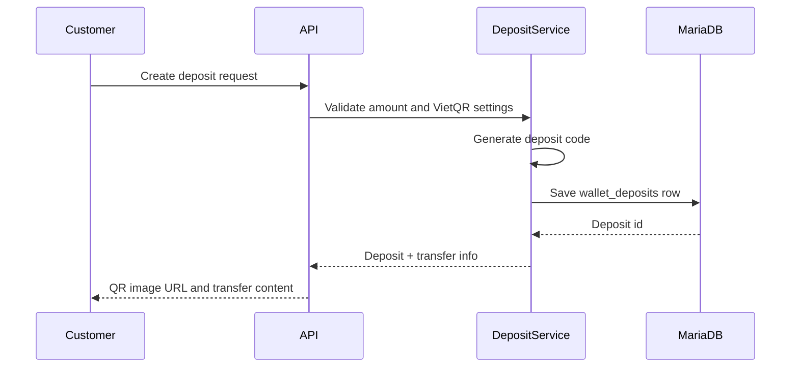
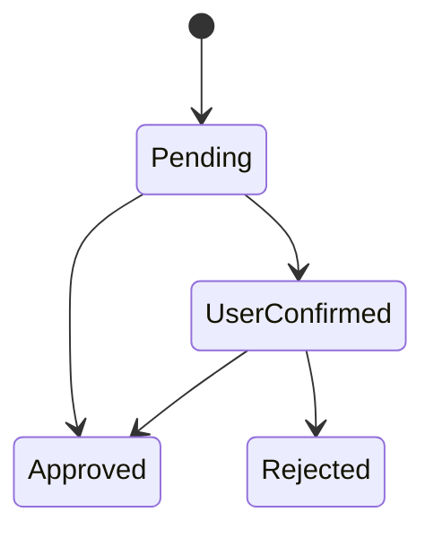
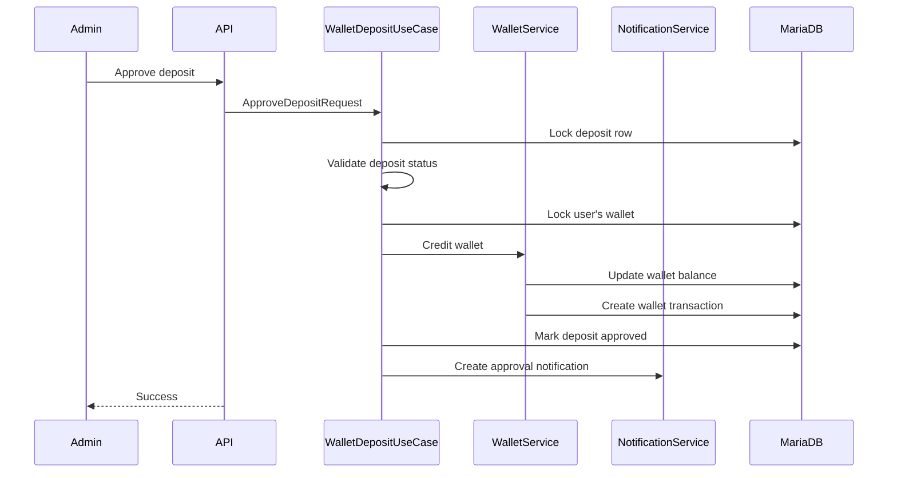
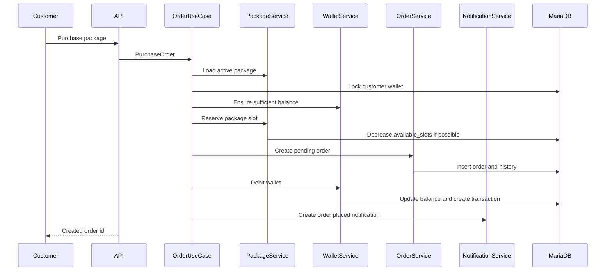
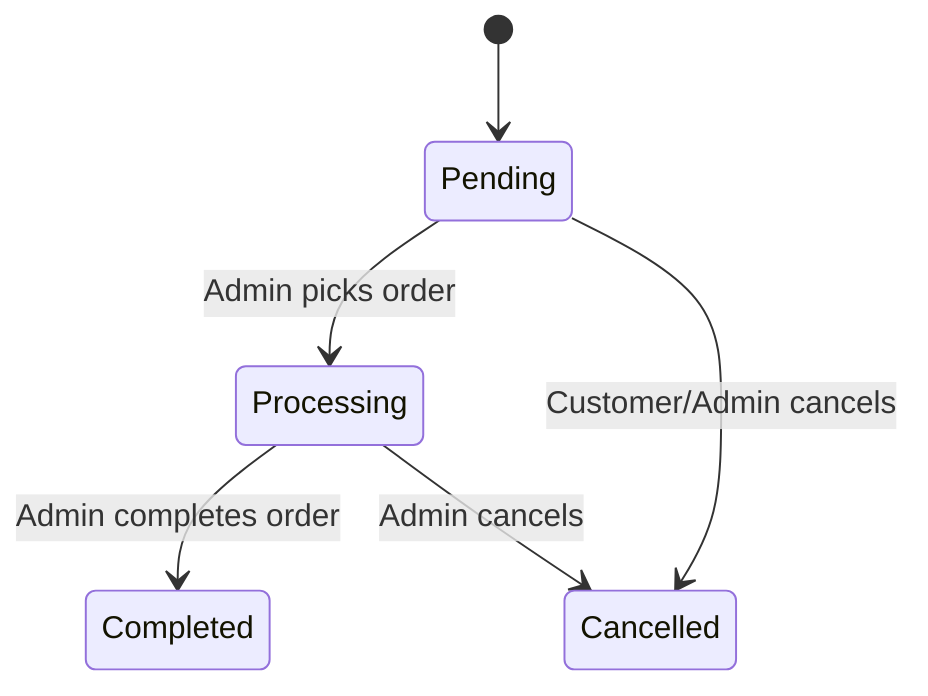
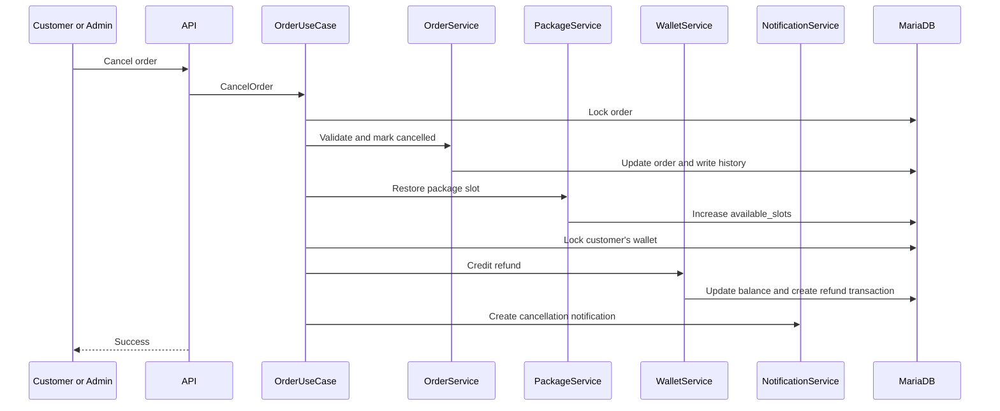

# Các workflow cốt lõi

🇺🇸 English: [../core-workflows.md](../core-workflows.md)

Phần lõi của GameTopUp nằm ở cách số dư ví, package availability và trạng thái đơn hàng thay đổi cùng nhau.

Các core workflows điều phối số dư ví, package availability và trạng thái đơn hàng khi khách hàng và quản trị viên dùng ứng dụng.

Architecture mô tả bức tranh tổng thể của hệ thống. Overview mô tả bối cảnh domain phía sau các workflow này.

## Vòng vận hành

Ở mức cao, ứng dụng hỗ trợ vòng vận hành sau:

```mermaid
flowchart LR
    Browse["Browse games and packages"]
    Deposit["Create wallet deposit"]
    Review["Admin reviews transfer"]
    Wallet["Wallet balance updated"]
    NotifyDeposit["Customer notified"]
    Purchase["Customer purchases package"]
    Process["Admin processes order"]
    NotifyOrder["Customer notified"]
    Done["Order completed or cancelled"]

    Browse --> Deposit
    Deposit --> Review
    Review --> Wallet
    Wallet --> NotifyDeposit
    NotifyDeposit --> Purchase
    Purchase --> Process
    Process --> NotifyOrder
    NotifyOrder --> Done
```

Mỗi bước đều để lại bản ghi. Deposit status, wallet transactions, order status, order history và thông báo tạo audit trail để kiểm tra lại khi cần.

## Nạp tiền vào ví

Khách hàng không thanh toán trực tiếp cho một order. Họ tạo yêu cầu nạp ví trước.

Luồng nạp ví trước tách bước duyệt thanh toán khỏi bước mua hàng. Khách hàng có thể chuẩn bị tiền một lần, rồi dùng số dư ví để đặt order sau đó.

Yêu cầu nạp tiền lưu:

- id khách hàng
- amount
- unique deposit code
- transfer content
- status
- thông tin review sau khi quản trị viên xử lý

QR image URL được tạo từ thông tin ngân hàng VietQR trong configuration. GameTopUp không tự động xác minh chuyển khoản ngân hàng. Người dùng xác nhận rằng họ đã chuyển tiền, sau đó quản trị viên review request.

Trong phạm vi này, ứng dụng mô phỏng một dịch vụ nhỏ nơi việc xác minh chuyển khoản vẫn là công việc của quản trị viên.

## Duyệt yêu cầu nạp tiền

Một yêu cầu nạp tiền đi qua một state machine nhỏ:

Khách hàng xác nhận yêu cầu nạp tiền của chính mình khi yêu cầu đang ở trạng thái `Pending`.

Quản trị viên có thể phê duyệt yêu cầu ở trạng thái `Pending` hoặc sau khi khách hàng xác nhận. Việc từ chối chỉ được thực hiện sau bước xác nhận của khách hàng.

Khi quản trị viên phê duyệt yêu cầu nạp tiền, workflow phải làm nhiều hơn là đổi trạng thái:

Việc cộng tiền vào ví và cập nhật trạng thái deposit diễn ra trong cùng một transaction boundary. Approval không nên tạo trạng thái nửa vời: deposit đã approved nhưng ví chưa được cộng tiền, hoặc ví đã được cộng nhưng review không được ghi lại.

Quản trị viên có thể ghi chú xử lý nếu cần. Approval cộng tiền vào ví; rejection chỉ ghi lại kết quả review và không đổi số dư. Cả hai kết quả đều tạo thông báo cho khách hàng.

Concurrency tests kiểm tra phiên bản rủi ro của workflow này: hai quản trị viên approve cùng một deposit gần như cùng lúc, hoặc một quản trị viên approve trong khi người khác reject cùng deposit đó. Kết quả mong muốn là chỉ có một quyết định review cuối cùng và tối đa một lần cộng ví.

## Luồng mua hàng

Purchase flow là nơi số dư ví, package availability và trạng thái đơn hàng gặp nhau.

Từ góc nhìn khách hàng, flow là chọn gói nạp, nhập thông tin tài khoản game và confirm purchase.

Từ góc nhìn backend, nhiều điều phải khớp với nhau:

- package phải tồn tại và đang active
- khách hàng phải có đủ số dư ví
- package availability không được xuống dưới 0
- order phải ghi lại package price tại thời điểm mua
- wallet deduction phải được ghi thành transaction

Backend không tạo order ngay từ bước đầu. Use case trước tiên validate package và wallet, giữ capacity, tạo order, rồi mới ghi wallet movement.

Package reservation dùng một câu update chỉ thành công khi vẫn còn đủ slots. Điều kiện update ngăn ứng dụng nhận nhiều order hơn khả năng xử lý của package.

GameTopUp theo dõi `available_slots` cho packages.

Trong bài toán này, một package không nhất thiết là một món hàng vật lý. Nó gần với capacity hơn: dịch vụ còn có thể nhận thêm bao nhiêu order cho package này?

Khi khách hàng mua package, một slot được giữ lại. Khi order bị huỷ, một slot được trả lại.

Mô hình này khớp với cách một dịch vụ nạp game nhỏ vận hành, nơi capacity bị giới hạn bởi số order còn có thể nhận, không phải bởi tồn kho vật lý.

## Xử lý đơn hàng

Sau khi purchase, order bắt đầu ở trạng thái `Pending`.

Quản trị viên có thể pick order để xử lý, complete order hoặc cancel order.

Thao tác pick gán order cho một quản trị viên và chuyển nó sang `Processing`. Thao tác complete chuyển order sang `Completed`. Các transition khách hàng cần biết sẽ tạo thông báo, nên khách không phải refresh trang đơn hàng để biết order đã bắt đầu xử lý hoặc đã hoàn tất.

Mỗi transition có ý nghĩa đều ghi order history. Order history ghi ai đã đổi trạng thái đơn và thời điểm thay đổi.

Pick flow dùng trạng thái `Pending` và assigned admin để xử lý race condition. Nếu hai quản trị viên cùng cố pick một pending order, chỉ một người trở thành assigned admin.

## Hủy đơn và hoàn tiền

Cancellation chạm tới nhiều phần trạng thái cùng lúc.

Nó không thể được xử lý như “set order status to cancelled”, vì một order đã purchase trước đó đã ảnh hưởng tới số dư ví và package availability.

Khi một order bị huỷ, workflow phải:

- lock order
- validate transition được phép
- ghi order history
- trả lại một package slot
- lock wallet của khách hàng
- cộng tiền lại vào wallet
- ghi refund transaction

Phần xử lý repeated cancellation trả về nếu order đã cancelled và không refund lần nữa. Hành vi này được kiểm tra bằng concurrency tests vì happy path không bao phủ double refund.

## Rủi ro đồng thời

Những phần rủi ro nhất của GameTopUp là nơi hai người dùng hoặc quản trị viên có thể hành động cùng lúc.

Các workflow nhạy cảm nhất là:

- hai khách hàng cùng cố mua slot cuối của một package
- hai quản trị viên cùng approve một deposit
- hai request cùng cố cancel một order
- một quản trị viên pick order trong lúc khách hàng cố cancel nó

Các trường hợp này không phải edge cases trừu tượng. Đây là những nơi số dư, package availability và trạng thái đơn hàng có thể lệch nhau nếu thiếu transaction boundaries và row locking.

Các flow nhạy cảm dùng transaction boundaries, row locking ở những nơi cần thiết và integration tests với MariaDB thay vì chỉ dựa vào mocked unit tests.

## Kiểm thử và ranh giới

Layered architecture triển khai các workflow này qua controllers, use cases, services, repositories và queries.

Các workflow rủi ro được kiểm chứng bằng unit tests, API scenario tests và database-backed integration tests.

- [Engineering Decisions](engineering-decisions.md) mô tả backend structure và test boundaries.
- [Testing](testing.md) cho thấy các luồng này được bảo vệ như thế nào.
