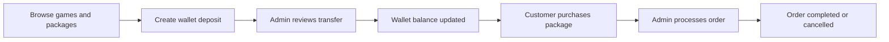
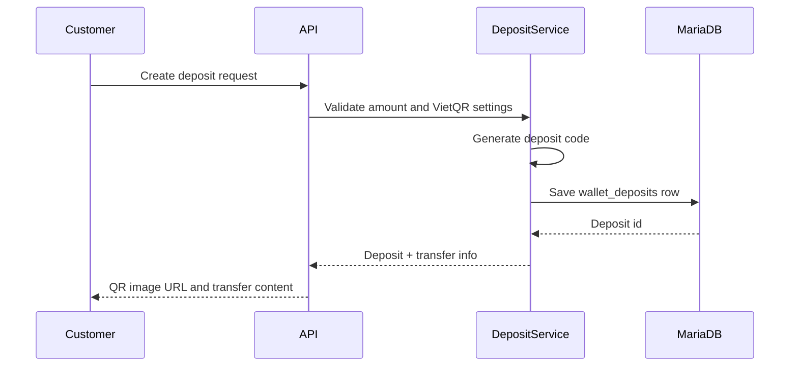
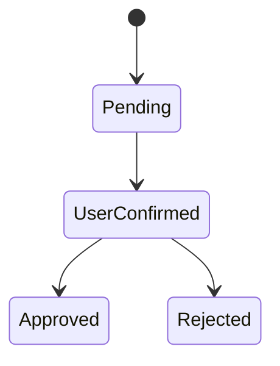
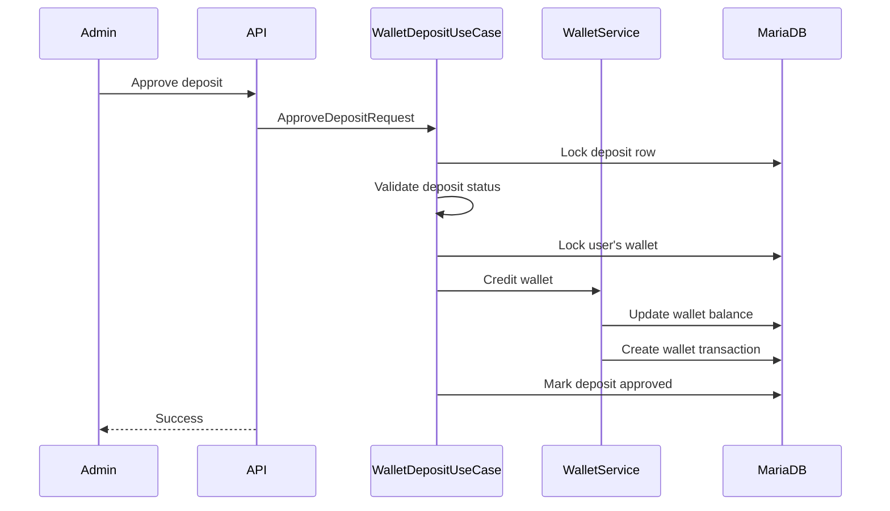
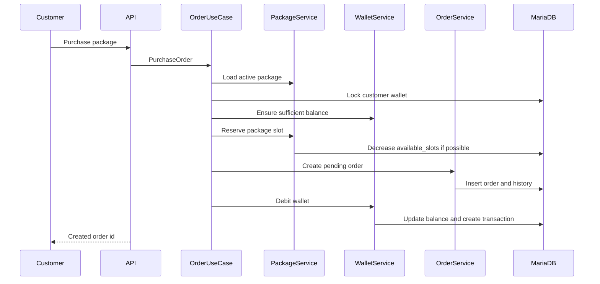
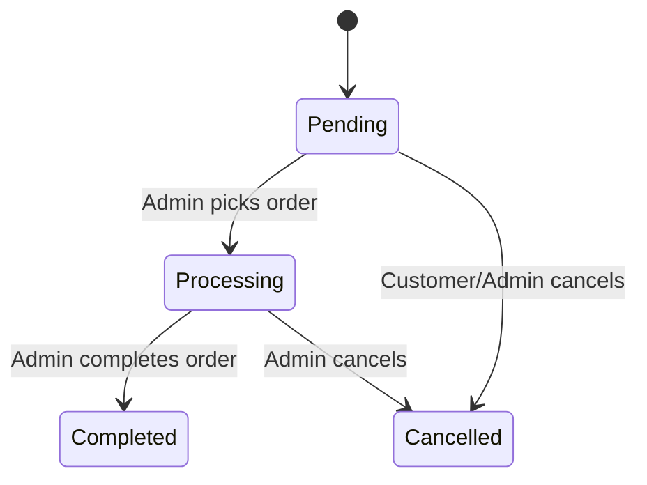
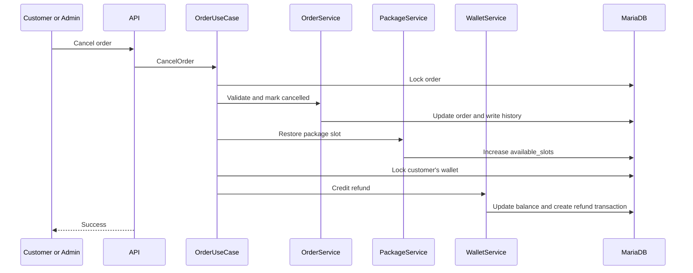

# Các workflow cốt lõi

🇺🇸 English: [../core-workflows.md](../core-workflows.md)

Phần lõi của GameTopUp nằm ở cách số dư ví, package availability và trạng thái đơn hàng thay đổi cùng nhau.

Tài liệu này giải thích những workflow cần được thiết kế cẩn thận nhất. Nội dung không đi sâu vào từng endpoint, mà tập trung vào những điều phải luôn đúng khi khách hàng và quản trị viên dùng ứng dụng.

Để xem bức tranh tổng thể của hệ thống, đọc [Architecture](architecture.md). Để hiểu vì sao các workflow này tồn tại, bắt đầu với [Overview](overview.md).

## Luồng vận hàng tổng thể

Ở mức cao, ứng dụng hỗ trợ vòng vận hành sau:

Mỗi bước đều để lại bản ghi. Deposit status, wallet transactions, order status và order history giúp workflow dễ kiểm tra lại hơn về sau.

## Nạp tiền vào ví

Khách hàng không thanh toán trực tiếp cho một order. Họ tạo yêu cầu nạp ví trước.

Cách này tách bước duyệt thanh toán khỏi bước mua hàng. Khách hàng có thể chuẩn bị tiền một lần, rồi dùng số dư ví để đặt order sau đó.

Yêu cầu nạp tiền lưu:

- id khách hàng
- amount
- unique deposit code
- transfer content
- current status
- thông tin review sau khi quản trị viên xử lý

QR image URL được tạo từ thông tin ngân hàng VietQR trong configuration. Dự án không tự động xác minh chuyển khoản ngân hàng. Người dùng xác nhận rằng họ đã chuyển tiền, sau đó quản trị viên review request.

Trong phạm vi hiện tại, ứng dụng mô phỏng một dịch vụ nhỏ nơi việc xác minh chuyển khoản vẫn là công việc của quản trị viên.

## Duyệt yêu cầu nạp tiền

Một yêu cầu nạp tiền đi qua một state machine nhỏ:

Khách hàng chỉ có thể xác nhận yêu cầu nạp tiền đang pending của chính họ. Admin approval chỉ được phép sau bước customer confirmation.

Khi quản trị viên approve deposit, workflow phải làm nhiều hơn là đổi status:

Việc cộng tiền vào ví và cập nhật trạng thái deposit diễn ra trong cùng một transaction boundary. Điều này quan trọng vì approval không nên tạo trạng thái nửa vời: deposit đã approved nhưng ví chưa được cộng tiền, hoặc ví đã được cộng nhưng review không được ghi lại.

Concurrency tests kiểm tra phiên bản rủi ro của workflow này: hai quản trị viên approve cùng một deposit gần như cùng lúc. Kết quả mong muốn là ví chỉ được cộng một lần.

## Luồng mua hàng

Purchase flow là nơi số dư ví, package availability và trạng thái đơn hàng gặp nhau.

Từ góc nhìn khách hàng, flow này khá dễ hiểu: chọn gói nạp, nhập thông tin tài khoản game và confirm purchase.

Từ góc nhìn backend, nhiều điều phải khớp với nhau:

- package phải tồn tại và đang active
- khách hàng phải có đủ số dư ví
- package availability không được xuống dưới 0
- order phải ghi lại package price tại thời điểm mua
- wallet deduction phải được ghi thành transaction

Backend không tạo order ngay từ bước đầu. Use case trước tiên validate package và wallet, giữ capacity, tạo order, rồi mới ghi wallet movement.

Package reservation dùng một câu update chỉ thành công khi vẫn còn đủ slots. Điều đó ngăn ứng dụng nhận nhiều order hơn khả năng xử lý của package.

GameTopUp theo dõi `available_slots` cho packages.

Trong bài toán này, một package không nhất thiết là một món hàng vật lý. Nó gần với capacity hơn: dịch vụ còn có thể nhận thêm bao nhiêu order cho package này?

Khi khách hàng mua package, một slot được giữ lại. Khi order bị huỷ, một slot được trả lại.

Cách mô hình hoá này khớp với cách một dịch vụ nạp game nhỏ vận hành, nơi capacity bị giới hạn bởi số order còn có thể nhận, không phải bởi tồn kho vật lý.

## Xử lý đơn hàng

Sau khi purchase, order bắt đầu ở trạng thái `Pending`.

Quản trị viên có thể pick order để xử lý, complete order hoặc cancel order.

Thao tác pick gán order cho một quản trị viên và chuyển nó sang `Processing`. Thao tác complete chuyển order sang `Completed`.

Mỗi transition có ý nghĩa đều ghi order history. Điều đó giúp order dễ kiểm tra lại hơn, nhất là khi có nhiều người cùng tham gia vận hành dịch vụ.

Dự án cũng bảo vệ pick flow khỏi race condition. Nếu hai quản trị viên cùng cố pick một pending order, chỉ một người trở thành assigned admin.

## Hủy đơn và hoàn tiền

Cancellation là một trong những workflow dễ làm sai nhất.

Nó không thể được xử lý như “set order status to cancelled”, vì một order đã purchase trước đó đã ảnh hưởng tới số dư ví và package availability.

Khi một order bị huỷ, workflow phải:

- lock order
- đảm bảo transition được phép
- ghi order history
- trả lại một package slot
- lock wallet của khách hàng
- cộng tiền lại vào wallet
- ghi refund transaction

Phần xử lý repeated cancellation được viết khá cẩn thận. Nếu order đã cancelled, workflow trả về mà không refund lần nữa. Hành vi này được kiểm tra bằng concurrency tests vì double refund là kiểu bug dễ bị bỏ sót nếu chỉ kiểm tra happy path.

## Đảm bảo tính nhất quán

Những phần rủi ro nhất của GameTopUp là nơi hai người dùng hoặc quản trị viên có thể hành động cùng lúc.

Các workflow nhạy cảm nhất là:

- hai khách hàng cùng cố mua slot cuối của một package
- hai quản trị viên cùng approve một deposit
- hai request cùng cố cancel một order
- một quản trị viên pick order trong lúc khách hàng cố cancel nó

Đây không phải edge cases trừu tượng. Đây là những nơi số dư, package availability và trạng thái đơn hàng có thể lệch nhau nếu workflow không được thiết kế cẩn thận.

Dự án dùng transaction boundaries rõ ràng, row locking ở những nơi cần thiết và integration tests với MariaDB thay vì chỉ dựa vào mocked unit tests.

## Đọc tiếp

Các workflow trong tài liệu này được triển khai thông qua layered architecture đã giới thiệu trước đó.

Các tài liệu tiếp theo giải thích vì sao những lựa chọn triển khai này phù hợp với dự án, và workflow được kiểm chứng bằng automated tests như thế nào.

- [Engineering Decisions](engineering-decisions.md) giải thích trade-offs phía sau cấu trúc.
- [Testing](testing.md) cho thấy các luồng này được bảo vệ như thế nào.
