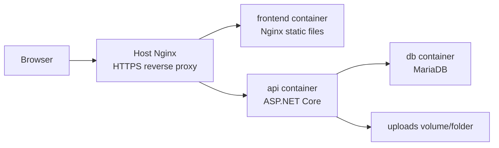
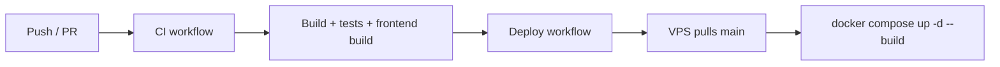

# Triển khai

🇺🇸 English: [../deployment.md](../deployment.md)

Live demo của GameTopUp chạy như một ứng dụng nhỏ trên VPS.

Docker Compose chạy containers, Nginx xử lý HTTPS traffic công khai, và GitHub Actions deploy nhánh `main` mới nhất lên VPS sau khi CI pass.

Quy trình triển khai build ứng dụng, chạy containers, định tuyến traffic qua Nginx, rồi cập nhật server từ GitHub Actions.

## Các service runtime

Docker Compose định nghĩa ba services:

| Service | Vai trò |
| ------- | ------- |
| `db` | MariaDB database với bước khởi tạo schema và seed |
| `api` | ASP.NET Core backend |
| `frontend` | Ứng dụng React đã build, được serve bằng Nginx |

API lưu uploaded files trong `wwwroot/uploads`; folder này được mount từ `uploads` của repository trong Compose setup.

## Build container image

Backend Dockerfile dùng multi-stage build.

Stage đầu restore và publish API bằng .NET SDK image. Runtime stage dùng ASP.NET Core Alpine image nhỏ hơn và chạy `GameTopUp.Api.dll`.

Build tooling không đi vào runtime image cuối cùng.

Frontend Dockerfile cũng dùng hai stages.

Build stage cài dependencies và tạo Vite production build. Runtime stage dùng Nginx để serve compiled static files.

Frontend Nginx config đưa unknown routes về `index.html`, điều cần thiết cho client-side routing.

Static assets được cache với immutable cache headers.

Khi cả hai ứng dụng đã được build thành containers, môi trường production không cần cài .NET SDK hoặc Node.js trên máy host để chạy ứng dụng.

## Chạy containers

[docker-compose.yml](../../docker-compose.yml) ở root là entry point chính để chạy containers.

Compose khởi động database, chờ nó healthy, rồi mới start API và frontend containers.

Mỗi container có một trách nhiệm.

Với database mới, container database khởi tạo schema và seed data với MariaDB 11. Database đã tồn tại dùng các file SQL trong `database/migrations`, chạy một lần theo đúng thứ tự. API cung cấp business logic trên port `8080` bên trong container. Frontend serve bản build React thông qua Nginx.

Runtime settings như database credentials, JWT, CORS, app URL và VietQR values được truyền qua environment variables.

## Định tuyến public traffic

Traffic công khai được route qua cấu hình Nginx trên host trong [deployments/nginx/gametopup.conf](../../deployments/nginx/gametopup.conf).

Config route:

| Path | Target |
| ---- | ------ |
| `/` | frontend container |
| `/api/` | backend API |
| `/uploads/` | backend API static files |

Config này cũng cấu hình HTTPS thông qua đường dẫn certificate của Let's Encrypt và redirect HTTP traffic sang HTTPS cho domain đã cấu hình.

## Cấu hình

Compose nhận giá trị từ `.env`, còn API map environment values vào configuration.

Các giá trị cấu hình gồm:

| Variable | Mục đích |
| -------- | -------- |
| `DB_ROOT_PASSWORD` | MariaDB root password |
| `DB_PASSWORD` | Application database password |
| `JWT_KEY` | JWT signing key |
| `APP_BASE_URL` | Public base URL dùng cho backend-generated links |
| `CORS_ALLOWED_ORIGINS` | Frontend origins được phép |
| `VITE_API_BASE_URL` | API base URL được compile vào frontend |
| `VIETQR_BANK_ID` | VietQR bank id |
| `VIETQR_ACCOUNT_NO` | VietQR account number |
| `VIETQR_ACCOUNT_NAME` | VietQR account name |

API map các environment variables này vào configuration khi startup. Cấu hình local và production dùng environment values thay vì hardcoded secrets, và cùng một application build chạy được ở cả hai môi trường.

## Quy trình triển khai

Deployment gắn với GitHub Actions.

Deploy workflow chạy sau khi CI workflow hoàn tất thành công trên `main`.

Nó kết nối tới VPS qua SSH, chuyển vào `/opt/gametopup`, fetch code mới nhất, reset working tree về `origin/main`, rebuild containers bằng Docker Compose và prune old images.

Đường đi từ repository đến live demo chạy qua GitHub Actions, VPS checkout và Docker Compose.

## Giới hạn triển khai

Setup có các giới hạn sau:

- chưa có blue-green deployment
- chưa có công cụ database migration tự động; database đã tồn tại dùng SQL migrations thủ công
- chưa có container registry workflow
- chưa có production monitoring stack trong repo
- uploaded files được lưu local trên server

Repository chứa application source, deployment configuration, GitHub Actions workflows và Docker Compose files dùng cho live demo.

## Chủ đề liên quan

Để xem deployment constraints, đọc [Engineering Decisions](engineering-decisions.md).

Để xem mô hình runtime rộng hơn, đọc [Architecture](architecture.md).
