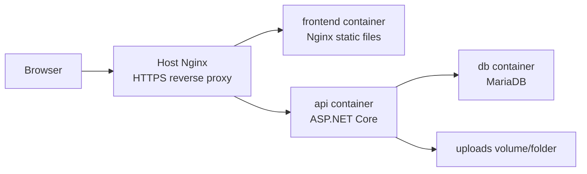
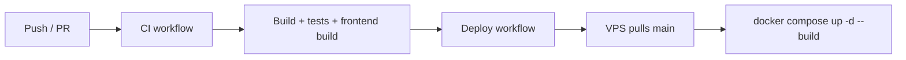

# Triển khai

🇺🇸 English: [../deployment.md](../deployment.md)

Live demo của GameTopUp chạy như một app nhỏ trên VPS.

Docker Compose chạy containers, Nginx xử lý public HTTPS traffic, và GitHub Actions deploy nhánh `main` mới nhất lên VPS sau khi CI pass.

Deployment path khá thẳng: build app, chạy containers, route traffic qua Nginx, rồi cập nhật server từ GitHub Actions.

## Kiến trúc khi chạy

Docker Compose định nghĩa ba services:

| Service | Vai trò |
| ------- | ------- |
| `db` | MariaDB database với schema và seed initialization |
| `api` | ASP.NET Core backend |
| `frontend` | React app đã build, được serve bằng Nginx |

API lưu uploaded files trong `wwwroot/uploads`, được mount từ folder `uploads` của repository trong Compose setup.

## Build ứng dụng

Backend Dockerfile dùng multi-stage build.

Stage đầu restore và publish API bằng .NET SDK image. Runtime stage dùng ASP.NET Core Alpine image nhỏ hơn và chạy `GameTopUp.Api.dll`.

Cách này giữ build tooling khỏi final runtime image.

Frontend Dockerfile cũng dùng hai stages.

Build stage install dependencies và tạo Vite production build. Runtime stage dùng Nginx để serve compiled static files.

Frontend Nginx config đưa unknown routes về `index.html`, điều cần thiết cho client-side routing.

Static assets được cache với immutable cache headers.

Khi cả hai application đã được build thành containers, production không cần cài local .NET SDK hoặc Node.js để chạy app.

## Chạy các containers

Root [docker-compose.yml](../../docker-compose.yml) là entry point chính để chạy containers.

Compose khởi động database, chờ nó healthy, rồi mới start API và frontend containers.

Mỗi container có một trách nhiệm.

Database khởi tạo schema và seed data với MariaDB 11. API expose business logic trên port `8080` bên trong container. Frontend serve React application đã build thông qua Nginx.

Runtime settings như database credentials, JWT, CORS, app URL và VietQR values được truyền qua environment variables.

## Điều hướng lưu lượng truy cập

Public traffic được route qua host Nginx config trong [deployments/nginx/gametopup.conf](../../deployments/nginx/gametopup.conf).

Config route:

| Path | Target |
| ---- | ------ |
| `/` | frontend container |
| `/api/` | backend API |
| `/uploads/` | backend API static files |

Nó cũng configure HTTPS thông qua Let's Encrypt certificate paths và redirect HTTP traffic sang HTTPS cho configured domain.

## Cấu hình

Project dùng `.env` values cho Compose và environment override logic trong API.

Các giá trị quan trọng gồm:

| Variable | Mục đích |
| -------- | -------- |
| `DB_ROOT_PASSWORD` | MariaDB root password |
| `DB_PASSWORD` | Application database password |
| `JWT_KEY` | JWT signing key |
| `APP_BASE_URL` | Public base URL dùng cho backend-generated links |
| `CORS_ALLOWED_ORIGINS` | Frontend origins được phép |
| `VITE_API_BASE_URL` | API base URL được compile vào frontend |
| `VIETQR_BANK_ID` | VietQR bank id |
| `VIETQR_ACCOUNT_NO` | VietQR account number |
| `VIETQR_ACCOUNT_NAME` | VietQR account name |

API map các environment variables này vào configuration khi startup. Cách đó giữ local và production configuration rõ ràng mà không hardcode secrets, đồng thời cho phép cùng một application chạy ở cả hai môi trường mà không đổi code.

## Quy trình triển khai

Deployment gắn với GitHub Actions.

Deploy workflow chạy sau khi CI workflow hoàn tất thành công trên `main`.

Nó kết nối tới VPS qua SSH, chuyển vào `/opt/gametopup`, fetch code mới nhất, reset working tree về `origin/main`, rebuild containers bằng Docker Compose và prune old images.

Workflow này đủ gọn để người đọc lần theo từ repository đến live demo đang chạy.

## Giới hạn hiện tại

Setup hiện tại có một vài giới hạn rõ ràng:

- chưa có blue-green deployment
- chưa có automated database migration tool
- chưa có container registry workflow
- chưa có production monitoring stack trong repo
- uploaded files được lưu local trên server

Những trade-off đó chấp nhận được ở giai đoạn này. Điều quan trọng hiện tại là project có một đường đi lặp lại được từ repository đến live demo.

## Đọc tiếp

Để hiểu vì sao các trade-off này được chọn, đọc [Engineering Decisions](engineering-decisions.md).

Để xem runtime shape rộng hơn, đọc [Architecture](architecture.md).
