# Kiểm thử

🇺🇸 English: [../testing.md](../testing.md)

Testing dần trở thành một phần quan trọng hơn khi các workflow của GameTopUp bắt đầu liên kết chặt với nhau.

Khi wallet balance, deposit review, package availability và order processing bắt đầu ảnh hưởng lẫn nhau, một bug không còn chỉ là response sai. Nó có thể là ví bị cộng tiền hai lần, package slot bị bán vượt khả năng, hoặc order rơi vào trạng thái không đúng.

Test suite tập trung quanh rủi ro đó. Coverage vẫn hữu ích, nhưng giá trị chính nằm ở việc bảo vệ những workflow dễ gây lỗi vận hành nhất.

## Chiến lược kiểm thử

Backend dựa vào hai nhóm tests:

| Project | Trọng tâm |
| ------- | --------- |
| `GameTopUp.UnitTests` | Business rules, services và use cases |
| `GameTopUp.IntegrationTests` | API behavior, database persistence, workflow consistency và concurrency |

Unit tests cho feedback nhanh với những rule có thể kiểm tra độc lập.

Integration tests kiểm tra những nơi API, database và workflow state cần chạy cùng nhau. Wallet locks, package slot updates, transaction boundaries và repeated admin actions đều phụ thuộc vào cách database thật hoạt động, nên các test đó chạy với MariaDB thay vì mocks.

Frontend hiện chưa có test suite riêng. Frontend checks trong CI là type checking và production build.

## Kiểm thử đơn vị

Unit tests tập trung vào các business rules nhỏ hơn, nơi feedback nên nhanh và tách biệt.

Chúng hữu ích khi rule có thể được kiểm tra mà không cần chạy toàn bộ API hoặc database. Điều này bao gồm validation, token behavior, wallet balance rules, deposit state transitions, package slot checks, order state transitions, image URL behavior và use case orchestration cho auth, orders và deposits.

Các test này vẫn có giá trị vì service layer chứa business rules thật, không chỉ forward calls sang repositories. Khi một business rule thay đổi, phần test liên quan thường cũng nằm rất gần phần code cần chỉnh sửa.

Backend structure cũng giúp ở điểm này. Khi transaction orchestration nằm trong use cases và services tập trung vào trách nhiệm nhỏ hơn, nhiều rule có thể được test mà không cần kéo database infrastructure vào unit test.

## Kiểm thử tích hợp

Integration tests chạy với MariaDB thông qua Testcontainers.

Lựa chọn này đến từ chính cách project vận hành. Nhiều workflow quan trọng phụ thuộc vào SQL behavior như row locking, transactions và conditional updates. Nếu thay chúng bằng một database in-memory, nhiều hành vi mà ứng dụng thật sự dựa vào sẽ không còn được kiểm tra nữa.

Integration setup chạy API bằng `WebApplicationFactory`, khởi động một disposable MariaDB container qua Testcontainers, load schema thật từ `database/schema.sql`, reset state giữa các test bằng Respawn và dùng test auth handler để scenario tập trung vào behavior của API.

Cách này cho phép tests chạy API và database cùng nhau mà không phụ thuộc vào một shared local database.

## Kiểm thử các kịch bản API

API scenario tests đi qua cả customer và admin workflows.

Ở phía customer, chúng kiểm tra các flow như authentication, public game và package browsing, wallet reads, deposit requests và orders. Ở phía admin, chúng kiểm tra dashboard data, game và package management, deposit review, order processing và user management.

Các test này không chỉ kiểm tra endpoint trả về `200`. Chúng seed data, gọi API và verify database state sau đó.

## Hành trình mua hàng hoàn chỉnh

Integration tests có một purchase journey đi theo business path chính.

```mermaid
flowchart LR
    Wallet["Seed wallet balance"]
    Package["Seed package"]
    Purchase["Create order"]
    VerifyDebit["Verify wallet debit"]
    VerifySlot["Verify slot reserved"]
    Pick["Admin picks order"]
    Complete["Admin completes order"]
    History["Verify history"]

    Wallet --> Package --> Purchase --> VerifyDebit --> VerifySlot --> Pick --> Complete --> History
```



Kiểu test này hữu ích vì purchase flow đi qua nhiều phần của app: wallet, package, order và history.

## Kiểm thử đồng thời

Concurrency tests là một trong những phần quan trọng nhất của test suite.

Chúng nhắm vào những lỗi thường chỉ xuất hiện khi nhiều request xảy ra gần như cùng lúc:

- hai customer cùng cố mua slot cuối của package
- hai admin cùng cố approve một deposit
- một admin approve trong khi admin khác reject cùng một deposit
- hai request cùng cancel một order
- một admin pick order trong khi customer cancel order đó
- hai admin cùng cố pick một order

Expected behavior không phải lúc nào cũng là “một request thành công, một request fail”. Một số operation là idempotent. Ví dụ, repeated cancellation không được tạo double refund.

Những test này giữ test suite thực tế hơn. Chúng kiểm tra các lỗi mà một happy-path demo có thể dễ dàng che mất.

## CI và độ bao phủ

CI pipeline đi theo cùng cách tách phần như repository.

Backend và frontend jobs được tách dựa trên changed paths.

Backend job restore và build .NET solution, chạy unit và integration tests, rồi publish test và coverage reports. Frontend job install npm dependencies, chạy TypeScript type checking và build frontend.

Cách tách này giữ workflow thực dụng. Một frontend-only change không cần chạy backend integration tests, và một backend-only change không cần rebuild frontend.

Coverage được thu bằng Coverlet và report qua ReportGenerator. CI publish reports tự động, nhưng coverage chỉ hữu ích khi những behavior quan trọng thật sự được bảo vệ. Một con số coverage cao sẽ không có nhiều ý nghĩa nếu wallet credits, refunds, package slots và order transitions không được test.

## Chạy kiểm thử trên máy

Useful backend commands:

```bash
dotnet test backend/GameTopUp.UnitTests/GameTopUp.UnitTests.csproj
dotnet test backend/GameTopUp.IntegrationTests/GameTopUp.IntegrationTests.csproj
dotnet test backend/GameTopUp.slnx
```

Useful frontend commands:

```bash
cd frontend
npm run typecheck
npm run build
```

Integration tests cần Docker vì mỗi test run khởi động một disposable MariaDB container thông qua Testcontainers.

## Bộ kiểm thử phản ánh điều gì về project

Tests cho thấy GameTopUp ưu tiên bảo vệ điều gì trước.

Chúng không dành nhiều năng lượng cho mọi button click hoặc mọi UI path có thể có. Nỗ lực hiện tại tập trung vào những nơi bug gây ảnh hưởng lớn nhất: thay đổi wallet balance, deposit approval, refunds, package capacity và order state transitions.

Trọng tâm đó khớp với project. GameTopUp được xây quanh các workflow nơi nhiều mảnh state di chuyển cùng nhau, nên tests dành phần lớn năng lượng ở đó.

Vẫn còn chỗ để phát triển, đặc biệt ở phía frontend. Interaction tests sẽ là bước tiếp theo hợp lý. Với phiên bản hiện tại, điều quan trọng nhất là các business-critical workflows đã có unit tests nhanh, API scenario tests và database-backed integration tests bảo vệ.

Nhìn lại, những test hữu ích nhất không phải là những test làm tăng coverage. Chúng là những test giúp mình thay đổi code tự tin hơn.

Hiện tại, suite đã lớn lên thành hơn 200 automated tests cho các core workflows của project.

Con số đó quan trọng ít hơn điều nó đại diện: các workflow có rủi ro vận hành cao, như wallet credits, package reservations, refunds và order state transitions, giờ có thể được thay đổi tự tin hơn.

## Đọc tiếp

Để xem các workflow này được ship như thế nào, đọc [Deployment](deployment.md).

Để hiểu các trade-off phía sau test strategy, xem [Engineering Decisions](engineering-decisions.md).
