# Kiểm thử

🇺🇸 English: [../testing.md](../testing.md)

Khi các workflow của GameTopUp bắt đầu liên kết chặt với nhau, kiểm thử không còn chỉ là bước kiểm tra API trả đúng response.

Khi số dư ví, duyệt nạp tiền, khả năng nhận đơn của gói nạp và xử lý đơn hàng bắt đầu ảnh hưởng lẫn nhau, một bug không còn chỉ là response sai. Nó có thể là ví bị cộng tiền hai lần, slot gói nạp bị bán vượt khả năng, hoặc order rơi vào trạng thái không đúng.

Test suite được xây quanh những rủi ro đó. Coverage vẫn cần theo dõi, nhưng phần quan trọng hơn là các workflow dễ gây lỗi vận hành nhất phải được bảo vệ bằng test.

## Chiến lược kiểm thử

Backend dựa vào hai nhóm tests:

| Dự án | Trọng tâm |
| ------- | --------- |
| `GameTopUp.UnitTests` | Business rules, services và use cases |
| `GameTopUp.IntegrationTests` | API behavior, database persistence, tính nhất quán của workflow và concurrency |

Unit tests cho feedback nhanh với những rule có thể kiểm tra độc lập.

Integration tests kiểm tra những nơi API, database và trạng thái workflow phải chạy cùng nhau. Wallet locks, cập nhật slot gói nạp, transaction boundaries và các thao tác quản trị lặp lại đều phụ thuộc vào cách database thật hoạt động, nên các test đó chạy với MariaDB thay vì mocks.

Frontend hiện chưa có test suite riêng. Frontend checks trong CI là type checking và production build.

## Kiểm thử đơn vị

Unit tests tập trung vào các business rules nhỏ hơn, nơi feedback nên nhanh và tách biệt.

Unit tests phù hợp với những rule có thể kiểm tra mà không cần chạy toàn bộ API hoặc database. Phần này bao gồm validation, token behavior, quy tắc số dư ví, chuyển trạng thái deposit, kiểm tra slot gói nạp, chuyển trạng thái order, image URL behavior và use case orchestration cho auth, orders và deposits.

Vì service layer chứa business rules thật, không chỉ chuyển tiếp call sang repositories, các test này vẫn bắt được những thay đổi quan trọng. Khi một business rule thay đổi, phần test liên quan thường cũng nằm rất gần phần code cần chỉnh sửa.

Cấu trúc backend cũng giúp ở điểm này. Khi transaction orchestration nằm trong use cases và services tập trung vào trách nhiệm nhỏ hơn, nhiều rule có thể được test mà không cần kéo database infrastructure vào unit test.

## Kiểm thử tích hợp

Integration tests chạy với MariaDB thông qua Testcontainers.

Lựa chọn này đến từ chính cách dự án vận hành. Nhiều workflow quan trọng phụ thuộc vào SQL behavior như row locking, transactions và conditional updates. Nếu thay chúng bằng một database in-memory, nhiều hành vi mà ứng dụng thật sự dựa vào sẽ không còn được kiểm tra nữa.

Integration setup chạy API bằng `WebApplicationFactory`, khởi động một disposable MariaDB container qua Testcontainers, load schema thật từ `database/schema.sql`, reset state giữa các test bằng Respawn và dùng test auth handler để scenario tập trung vào API behavior.

Cách này cho phép tests chạy API và database cùng nhau mà không phụ thuộc vào một database local dùng chung.

## Kiểm thử các kịch bản API

API scenario tests đi qua cả workflow của khách hàng lẫn quản trị viên.

Ở phía khách hàng, chúng kiểm tra các flow như authentication, duyệt game và package công khai, đọc ví, yêu cầu nạp tiền và đơn hàng. Ở phía quản trị viên, chúng kiểm tra dữ liệu dashboard, quản lý game và package, duyệt nạp tiền, xử lý đơn hàng và quản lý người dùng.

Các test này không chỉ kiểm tra endpoint trả về `200`. Chúng seed data, gọi API và kiểm tra database state sau đó.

## Hành trình mua hàng hoàn chỉnh

Integration tests có một purchase journey đi theo business path chính.

```mermaid
flowchart LR
    Wallet["Seed wallet balance"]
    Package["Seed package"]
    Purchase["Create order"]
    VerifyDebit["Verify wallet debit"]
    VerifySlot["Verify slot reserved"]
    Pick["Admin picks order"]
    Complete["Admin completes order"]
    History["Verify history"]

    Wallet --> Package --> Purchase --> VerifyDebit --> VerifySlot --> Pick --> Complete --> History
```



Kiểu test này đáng có vì purchase flow đi qua nhiều phần của ứng dụng cùng lúc: wallet, package, order và history.

## Kiểm thử đồng thời

Mình xem concurrency tests là một trong những phần quan trọng nhất của test suite.

Chúng nhắm vào những lỗi thường chỉ xuất hiện khi nhiều request xảy ra gần như cùng lúc:

- hai khách hàng cùng cố mua slot cuối của package
- hai quản trị viên cùng cố approve một deposit
- một quản trị viên approve trong khi quản trị viên khác reject cùng một deposit
- hai request cùng cancel một order
- một quản trị viên pick order trong khi khách hàng cancel order đó
- hai quản trị viên cùng cố pick một order

Kết quả mong muốn không phải lúc nào cũng là “một request thành công, một request bị từ chối”. Một số operation là idempotent. Ví dụ, repeated cancellation không được tạo double refund.

Những test này kéo test suite lại gần cách hệ thống thật vận hành hơn. Chúng kiểm tra các lỗi mà một happy-path demo có thể dễ dàng che mất.

## CI và độ bao phủ

CI pipeline đi theo cùng cách tách phần như repository.

Backend và frontend jobs được tách dựa trên changed paths.

Backend job restore và build .NET solution, chạy unit và integration tests, rồi publish test và coverage reports. Frontend job cài npm dependencies, chạy TypeScript type checking và build frontend.

Cách tách này giữ workflow thực dụng. Một frontend-only change không cần chạy backend integration tests, và một backend-only change không cần rebuild frontend.

Coverage được thu bằng Coverlet và report qua ReportGenerator. CI publish reports tự động, nhưng coverage chỉ hữu ích khi những hành vi quan trọng thật sự được bảo vệ. Một con số coverage cao sẽ không có nhiều ý nghĩa nếu cộng tiền vào ví, hoàn tiền, slot gói nạp và chuyển trạng thái đơn hàng không được test.

## Chạy kiểm thử trên máy

Các lệnh backend thường dùng:

```bash
dotnet test backend/GameTopUp.UnitTests/GameTopUp.UnitTests.csproj
dotnet test backend/GameTopUp.IntegrationTests/GameTopUp.IntegrationTests.csproj
dotnet test backend/GameTopUp.slnx
```

Các lệnh frontend thường dùng:

```bash
cd frontend
npm run typecheck
npm run build
```

Integration tests cần Docker vì mỗi lần chạy test sẽ khởi động một disposable MariaDB container thông qua Testcontainers.

## Bộ kiểm thử phản ánh điều gì về dự án

Tests cho thấy GameTopUp ưu tiên bảo vệ điều gì trước.

Chúng không dành nhiều năng lượng cho mọi button click hoặc mọi UI path có thể có. Nỗ lực hiện tại tập trung vào những nơi bug gây ảnh hưởng lớn nhất: thay đổi số dư ví, duyệt nạp tiền, hoàn tiền, slot gói nạp và chuyển trạng thái đơn hàng.

Trọng tâm đó khớp với cách GameTopUp được xây dựng. Dự án xoay quanh các workflow nơi nhiều mảnh state di chuyển cùng nhau, nên tests dành phần lớn năng lượng ở đó.

Vẫn còn chỗ để phát triển, đặc biệt ở phía frontend. Interaction tests sẽ là bước tiếp theo hợp lý. Với phiên bản hiện tại, điều quan trọng nhất là các workflow quan trọng về nghiệp vụ đã có unit tests nhanh, API scenario tests và database-backed integration tests bảo vệ.

Nhìn lại, những test hữu ích nhất không phải là những test làm tăng coverage. Chúng là những test giúp mình đổi logic ví, slot gói nạp hoặc trạng thái đơn hàng mà vẫn biết các luồng rủi ro còn được bảo vệ.

Hiện tại, suite đã tăng lên hơn 200 automated tests cho các core workflows của dự án.

Điều quan trọng không nằm ở con số đó, mà ở việc các workflow có rủi ro vận hành cao, như cộng tiền vào ví, giữ slot gói nạp, hoàn tiền và chuyển trạng thái đơn hàng, giờ có thể được thay đổi tự tin hơn.

## Đọc tiếp

Để xem các workflow này được triển khai như thế nào, đọc [Deployment](deployment.md).

Để hiểu các trade-off phía sau chiến lược kiểm thử, xem [Engineering Decisions](engineering-decisions.md).
