# Kiểm thử

🇺🇸 English: [../testing.md](../testing.md)

Test suite của GameTopUp tập trung vào những workflow nơi trạng thái vận hành có thể bị lệch.

Số dư ví, duyệt nạp tiền, khả năng nhận đơn của gói nạp và xử lý đơn hàng ảnh hưởng lẫn nhau. Một bug trong các flow này không chỉ là response sai; nó có thể là ví bị cộng tiền hai lần, slot gói nạp bị bán vượt khả năng, hoặc order rơi vào trạng thái không đúng.

Test suite được xây quanh những rủi ro đó. Coverage vẫn được thu thập, còn các test chính nhắm vào workflow có thể ảnh hưởng tới số dư, slot gói nạp hoặc trạng thái đơn hàng.

## Chiến lược kiểm thử

Backend dựa vào hai nhóm tests:

| Test project | Trọng tâm |
| ------- | --------- |
| `GameTopUp.UnitTests` | Business rules, services và use cases |
| `GameTopUp.IntegrationTests` | API behavior, database persistence, workflow consistency và concurrency |

Unit tests cho feedback nhanh với những rule có thể kiểm tra độc lập.

Integration tests kiểm tra những nơi API, database và trạng thái workflow phải chạy cùng nhau. Wallet locks, cập nhật slot gói nạp, transaction boundaries và các thao tác quản trị lặp lại đều phụ thuộc vào cách database thật hoạt động, nên các test đó chạy với MariaDB thay vì mocks.

Frontend chưa có test suite riêng. Frontend checks trong CI là type checking và production build.

## Kiểm thử đơn vị

Unit tests tập trung vào các business rules nhỏ hơn, nơi feedback nên nhanh và tách biệt.

Unit tests bao phủ những rule có thể kiểm tra mà không cần chạy toàn bộ API hoặc database. Nhóm này bao gồm validation, token behavior, quy tắc số dư ví, chuyển trạng thái deposit, tạo thông báo, kiểm tra slot gói nạp, chuyển trạng thái order, image URL behavior và use case orchestration cho auth, orders và deposits.

Service layer chứa business rules, không chỉ chuyển tiếp call sang repositories. Service tests thường fail gần rule đang thay đổi.

Transaction orchestration nằm trong use cases. Services xử lý các business-rule responsibility nhỏ hơn, nên nhiều rule có thể được test mà không cần database infrastructure.

## Kiểm thử tích hợp

Integration tests chạy với MariaDB thông qua Testcontainers.

Nhiều workflow phụ thuộc vào SQL behavior như row locking, transactions và conditional updates. Nếu thay chúng bằng một database in-memory, nhiều hành vi mà ứng dụng dựa vào sẽ không còn được kiểm tra nữa.

Integration setup chạy API bằng `WebApplicationFactory`, khởi động một disposable MariaDB container qua Testcontainers, load schema thật từ `database/schema.sql`, reset state giữa các test bằng Respawn và dùng test auth handler để scenario tập trung vào API behavior.

Integration setup cho phép tests chạy API và database cùng nhau mà không phụ thuộc vào một database local dùng chung.

## Kiểm thử các kịch bản API

API scenario tests đi qua cả workflow của khách hàng lẫn quản trị viên.

Ở phía khách hàng, chúng kiểm tra các flow như authentication, duyệt game và package công khai, đọc ví, yêu cầu nạp tiền, thông báo và đơn hàng. Ở phía quản trị viên, chúng kiểm tra dữ liệu dashboard, quản lý game và package, duyệt nạp tiền, xử lý đơn hàng và quản lý người dùng.

API scenario tests không chỉ kiểm tra endpoint trả về `200`. Chúng seed data, gọi API và kiểm tra database state sau đó.

## Hành trình mua hàng hoàn chỉnh

Integration tests có một purchase journey đi theo business path chính.

```mermaid
flowchart LR
    Wallet["Seed wallet balance"]
    Package["Seed package"]
    Purchase["Create order"]
    VerifyDebit["Verify wallet debit"]
    VerifySlot["Verify slot reserved"]
    Pick["Admin picks order"]
    Complete["Admin completes order"]
    History["Verify history"]

    Wallet --> Package --> Purchase --> VerifyDebit --> VerifySlot --> Pick --> Complete --> History
```



Purchase journey đi qua nhiều phần của ứng dụng cùng lúc: wallet, package, order và history.

## Kiểm thử đồng thời

Concurrency tests bao phủ các request xảy ra gần như cùng lúc.

Chúng nhắm vào những lỗi thường chỉ xuất hiện khi nhiều request xảy ra gần như cùng lúc:

- hai khách hàng cùng cố mua slot cuối của package
- hai quản trị viên cùng cố approve một deposit
- một quản trị viên approve trong khi quản trị viên khác reject cùng một deposit
- hai request cùng cancel một order
- một quản trị viên pick order trong khi khách hàng cancel order đó
- hai quản trị viên cùng cố pick một order

Kết quả mong muốn không phải lúc nào cũng là “một request thành công, một request bị từ chối”. Một số operation là idempotent. Ví dụ, repeated cancellation không được tạo double refund.

Concurrency tests kiểm tra các lỗi mà một happy-path demo có thể che mất.

## CI và độ bao phủ

CI pipeline đi theo cùng cách tách phần như repository.

Backend và frontend jobs được tách dựa trên changed paths.

Backend job restore và build .NET solution, chạy unit và integration tests, rồi publish test và coverage reports. Frontend job cài npm dependencies, chạy TypeScript type checking và build frontend.

Path-based CI tách backend và frontend jobs. Một frontend-only change không cần chạy backend integration tests, và một backend-only change không cần rebuild frontend.

Coverage được thu bằng Coverlet và report qua ReportGenerator. CI publish reports tự động. Workflow tests bao phủ cộng tiền vào ví, hoàn tiền, slot gói nạp và chuyển trạng thái đơn hàng.

## Chạy kiểm thử trên máy

Các lệnh backend thường dùng:

```bash
dotnet test backend/GameTopUp.UnitTests/GameTopUp.UnitTests.csproj
dotnet test backend/GameTopUp.IntegrationTests/GameTopUp.IntegrationTests.csproj
dotnet test backend/GameTopUp.slnx
```

Các lệnh frontend thường dùng:

```bash
cd frontend
npm run typecheck
npm run build
```

Integration tests cần Docker vì mỗi lần chạy test sẽ khởi động một disposable MariaDB container thông qua Testcontainers.

## Độ phủ workflow

Test suite tập trung vào các workflow backend nơi nhiều phần trạng thái thay đổi cùng nhau.

Phần frontend có các kiểm tra cơ bản: type checking và production build trong CI.

Workflow coverage tập trung nhiều nhất quanh logic ví, gói nạp và trạng thái đơn hàng.

Suite có hơn 200 automated tests.

## Chủ đề liên quan

Để xem các workflow này được triển khai như thế nào, đọc [Deployment](deployment.md).

Để xem test boundaries và giới hạn của database-backed testing, đọc [Engineering Decisions](engineering-decisions.md).
